## Основные типичные вопросы на должность Middle System Administrator


***

# Основы:

#### 1. Что такое RFC?
Ответ:
RFC (Request for Comments) - Запрос комментариев - документ из серии пронумерованных информационных документов Интернета, содержащих технические спецификации и Стандарты, широко применяемые во Всемирной сети.

#### 2. Стек протокола TCP/IP (количество уровней, в чем отличие от классической модели OSI?)
Ответ:
Содержит 5 уровней, совмещены прикладной с представительским уровнем и сеансовый с транспортным.

#### 3. Что такое MTU?
Ответ:
MTU (Maximum Transmission Unit) - используется для определения максимального размера блока (в байтах), который может быть передан на канальном уровне коммуникационного протокола.

#### 4. Протокол ARP и его назначение
Ответ:
ARP (Address Resolution Protocol — протокол разрешения адресов) — протокол сетевого уровня, предназначенный для преобразования IP-адресов (адресов сетевого уровня) в MAC-адреса (адреса канального уровня) в сетях TCP/IP.

#### 5. Основные различия между протоколами TCP и UDP.  
Ответ:
Основное различие между TCP и UDP заключается в отношении к связи между компьютерами. Протокол TCP устанавливает соединение, при помощи которого компьютеры физически обмениваются сообщениями друг с другом, и при этом компьютер на одном конце соединения знает о компьютере на другом конце соединения. Протокол UDP не устанавливает соединение;
задача этого протокола — собрать сообщение, пристыковать к нему IP-адрес компьютера-получателя и отправить получившийся пакет в сеть. При этом протокол UDP ничего не знает о физическом соединении между компьютерами.

#### 6.	Что означает шлюз по умолчанию
В этом случае все ваши пакеты направляются на маршрутизатор. Остальные сегменты сети остаются недоступными вам до тех пор пока вы вручную не создадите статические маршруты них.
	
#### 7. Имеется сеть 128.108.200.0/16, напишите ее сетевую маску, сетевой и широковещательный адрес.
Ответ:
Сетевая маска: 255.255.0.0
Сетевой адрес: 128.108.0.0
Широковещательный адрес: 128.108.255.255
 
#### 8. К какому классу сетей относится адрес 228.224.17.13?
Ответ:
Данный адрес относится к классу D (групповая адресация)

#### 9. Какими командами можно просмотреть содержимое таблицы маршрутизации?
Ответ: netstat, route, ip r, ip r list, ip route

#### 10. DNS — назовите назначение и основные типы записей. На что указывает запись SOA? На каком уровне модели OSI работает?
Ответ:
DNS (Domain Name System — система доменных имён) — распределённая система (распределённая база данных), способная по запросу, содержащему доменное имя хоста (компьютера или другого сетевого устройства), сообщить IP адрес или (в зависимости от запроса) другую информацию
A, AAA, PTR, CNAME, MX, SOA, SRV
Запись SOA (Start of Authority) или начальная запись зоны указывает, на каком сервере хранится эталонная информация о данном домене, содержит контактную информацию лица, ответственного за данную зону, тайминги кеширования зонной информации и взаимодействия DNS-серверов.
Работает на представительском уровне.

#### 11. Сколько DNS серверов необходимо иметь для поддержки зоны?
Ответ: два Primary и Secondary.

#### 12. Что делает команда «NSLOOKUP»? 
- nslookup – утилита, которая предоставляет пользователю делать запрос к DNS-серверам.
Использование: nslookup “доменное имя” – выдаст в ответ ip-адрес, а nslookup “ ip-адрес” – выдаст доменное имя.
Или nslookup “доменное имя” “DNS-сервер” – выдаст в ответ ip-адрес, но при этом , в качестве источника информации, используя указанный DNS-сервер.

#### 13. DHCP — назначение, уровень модели OSI? Есть ли зависимость между протоколами BOOTP и DHCP? Параметры передаваемые данным протоклом?
Ответ:
DHCP (Dynamic Host Configuration Protocol — протокол динамической конфигурации узла) — это сетевой протокол, позволяющий компьютерам автоматически получать IP-адрес и другие параметры, необходимые для работы в сети TCP/IP. Данный протокол работает по модели «клиент-сервер».
Зависимость есть, DHCP является надстройкой над BOOTP
Основные передаваемые параметры: сервера DNS, Wins, NTP,  Proxy и пр.

#### 14. веб-сервер не пингуется, то как установить работает ли он?
telnet server.server.ru 80

####  15. Опишите своими словами функции и синтаксис команды «PING». Назовите известные вам ключи этой команды.
Команда ping отправляет запросы указанному узлу сети и замеряет поступаю-
щие ответы. 
- Время между отправкой запроса и получением ответа позволяет определить 
частоту потери пакетов (если она есть), и наличие проверяемого узла (шлюз провай-
дера, почтовый сервер). 
- Эта команда позволяет косвенно определять загруженность канала передачи 
данных.
Использование:
ping (ключи) ip-адрес узла
Ключи (основные):
- -t – продолжает посылать пакеты до команды прерывания программы пользователем 
(«вечный» ping)
- -l – размер пакета (в Windows XP максимальное значение 65500 байт )
- -n – число отправляемых запросов.
Примечания. Данная команда будет давать результат только при разрешении прото-
кола ICMP, или данного ответа протокола ICMP на «пингуемом» узле

#### 16. В чем сходства и различия дисковых интерфейсов SCSI, iSCSI и SAS?
Ответ:
- SCSI - (Small Computer System Interface) — интерфейс, разработанный для объединения на одной шине различных по своему назначению устройств, таких как жёсткие диски, накопители на магнитооптических дисках, приводы CD, DVD, стримеры, сканеры, принтеры и т. д.
- iSCSI - это протокол SCSI через IP, связывающий сервер с хранилищем данных. Другие протоколы обеспечивают соединение Fibre Channel - Fibre Channel с различной степенью интеллектуальности.
- Serial Attached SCSI (SAS) — компьютерный интерфейс, разработанный для обмена данными с такими устройствами, как жёсткие диски, накопители на оптическом диске и т. д. SAS использует последовательный интерфейс для работы с непосредственно подключаемыми накопителями (Direct Attached Storage (DAS) devices). SAS разработан для замены параллельного интерфейса SCSI и позволяет достичь более высокой пропускной способности, чем SCSI; в то же время SAS совместим с интерфейсом SATA. Хотя SAS использует последовательный интерфейс в отличие от параллельного интерфейса, используемого традиционным SCSI, для управления SAS-устройствами по-прежнему используются команды SCS

#### 17. Какие уровни RAID знаете? Дайте краткое описание.

Ответ:
- RAID0 - «чередование» (striping)
- RAID1 - «зеркалирование» (mirroring)
- RAID5 – чередование с контролем четности
- RAID10 – диски объединяются парами в зеркала с последующим чередованием
- RAID50 - объединение двух(или более, но это крайне редко применяется) массивов RAID5 в страйп, т.е. комбинация RAID5 и RAID0

#### 
***
# Вопросы для сетевиков:
***

####  1. Расскажите про сетевую модель OSI более подробно.
- 1 уровень. Физический (physical). Единицей нагрузки (PDU) здесь является бит. Кроме единиц и нулей физический уровень не знает ничего. На этом уровне работают провода, патч панели, сетевые концентраторы (хабы, которые сейчас уже сложно найти в привычных нам сетях), сетевые адаптеры. Именно сетевые адаптеры и ничего более из компьютера. Сам сетевой адаптер принимает последовательность бит и передает её дальше.
- 2 уровень. Канальный (data link). PDU - кадр (frame). На этом уровне появляется адресация. Адресом является MAC адрес. Канальный уровень ответственен за доставку кадров адресату и их целостность. В привычных нам сетях на канальном уровне работает протокол ARP. Адресация второго уровня работает только в пределах одного сетевого сегмента и ничего не знает о маршрутизации - этим занимается вышестоящий уровень. Соответственно, устройства, работающие на L2 - коммутаторы, мосты и драйвер сетевого адаптера.
- 3 уровень. Сетевой (network). PDU пакет (packet). Наиболее распространенным протоколом (дальше не буду говорить про “наиболее распространенный” - статья для новичков и с экзотикой они, как правило,  не сталкиваются) тут является IP. Адресация происходит по IP-адресам, которые состоят из 32 битов. Протокол маршрутизируемый, то есть пакет способен попасть в любую часть сети через какое-то количество маршрутизаторов. На L3 работают маршрутизаторы.
- 4 уровень. Транспортный (transport). PDU сегмент (segment)/датаграмма (datagram). На этом уровне появляются понятия портов. Тут трудятся TCP и UDP. Протоколы этого уровня отвечают за прямую связь между приложениями и за надежность доставки информации. Например, TCP умеет запрашивать повтор передачи данных в случае, если данные приняты неверно или не все. Так же TCP может менять скорость передачи данных, если сторона приема не успевает принять всё (TCP Window Size).
Следующие уровни “правильно” реализованы лишь в RFC. На практике же, протоколы описанные на следующих уровнях работают одновременно на нескольких уровнях модели OSI, поэтому нет четкого разделения на сеансовый и представительский уровни. В связи с этим в настоящее время основным используемым стеком является TCP/IP, о котором поговорим чуть ниже.
- 5 уровень. Сеансовый (session). PDU данные (data). Управляет сеансом связи, обменом информации, правами. Протоколы - L2TP, PPTP.
- 6 уровень. Представительский (presentation). PDU данные (data). Преставление и шифрование данных. JPEG, ASCII, MPEG.
- 7 уровень. Прикладной (application). PDU данные (data). Самый многочисленный и разнообразный уровень. На нем выполняются все высокоуровненвые протоколы. Такие как POP, SMTP, RDP, HTTP и т.д. Протоколы здесь не должны задумываться о маршрутизации или гарантии доставки информации - этим занимаются нижестоящие уровни. На 7 уровне необходима лишь реализации конкретных действий, например получение html-кода или email-сообщения конкретному адресату.


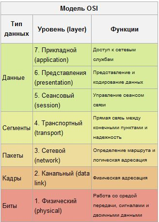

####  2. На каких портах по умолчанию работают следующие службы: DNS, HTTP, HTTPS, SMTP, POP3, IMAP.

DNS – 53 порт
HTTP – 80 порт
HTTPS – 443 порт
SMTP – 25 порт
POP3 – 110 порт
IMAP – 143 порт

####  3. какая разница между коммутатором, маршрутизатором и концентратором?
Концентратор (хаб) - сетевое устройство, для объединения нескольких устройств Ethernet в общий сегмент. Получив пакет, концентратор пересылает его на все свои порты, кроме исходного.
Сетевой коммутатор (свитч) - устройство, предназначенное для соединения нескольких узлов компьютерной сети в пределах одного сегмента. В отличие от концентратора, который распространяет трафик от одного подключенного устройства ко всем остальным, коммутатор передает данные только непосредственно получателю.
Маршрутизатор (роутер) - сетевое устройство, на основании информации о топологии сети и определённых правил принимающее решения о пересылке пакетов. Применяется в качестве "моста" между двумя сетями, является более сложным, чем свитч. Часто имеет собственный фаерволл.

####  4. что такое APIPA ?
Технология, которая позволяет автоматически создаавать IP-сеть без конфигурации или специальных серверов.

####  5. что такое WPA/WEP?
Алгоритмы для обеспечения безопасности сетей Wi-Fi

####  6. что такое протокол SNMP
Простой протокол управления сетями — это протокол управления сетями связи на основе архитектуры UDP. Устройства, которые обычно поддерживают SNMP это роутеры, свитчи, серверы, рабочие станции, принтеры, модемы и т.д.

####  7. что такое VPN и какие основные варианты вы знаете?
Виртуальная частная сеть - обобщённое название технологий, позволяющих обеспечить одно или несколько сетевых соединений (логическую сеть) поверх другой сети (например, Интернет). Виды: IPSec, PPTP, L2TP, EasyVPN, SSLVPN

####  8. как должен быть обжат кабель Ethernet при соединении двух компьютеров на прямую?
cross-over

####  9. Раскажите про обжим витой пары, какие варианты возможны.
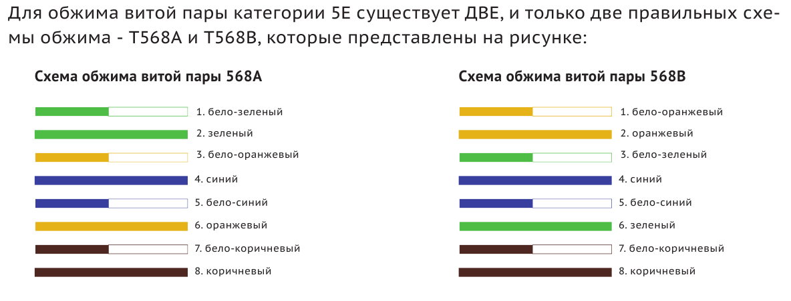

####  10. Назовите определения и особенности следующих сетевых протоколов – POP3, SMTP, IMAP.
POP3 – Post Office Protocol v.3
Протокол используется для хранения почты на сервере и выдачи ее клиенту элек-
тронной почты на компьютере пользователя. Особенностью является то, что почта с 
сервера потом удаляется. Но есть возможность письма с сервера не удалять. В один 
момент времени возможно подключение только одного пользователя к своему ящику.
SMTP – Simple Mail Transfet Protocol.
Простой протокол передачи почты.
Протокол используется только для отправки и пересылки почты между почтовыми 
серверами и приложениями для работы с электронной почтой.
IMAP – Internet Message Access Protocol.
Протокол доступа к электронной почте Интернета.
Также используется для хранения почты на сервере, но имеет ряд отличительных 
особенностей (по сравнению с POP3):
- Письма хранятся на сервере, а не на компьютере пользователя, но при этом можно настроить, чтобы копия письма хранилась и на компьютере.
- Можно одновременно подключиться к одному и тому же почтовому ящику с разных клиентов.
- Поддерживается нескольких почтовых ящиков (или папок). Клиент может создавать, удалять и переименовывать папки прямо на сервере, а также перемещать письма из одной папки или почтового ящика в другой.
- Возможно создание общих папок, к которым могут иметь доступ несколько пользователей.

####  11. Расскажите своими словами, что такое NAT.
- NAT (Network Adress Translation – Трансляция сетевых адресов) — это процесс трансляции (или подстановки) локальных адресов во внешние. 
- Маршрутизатор запоминает внутренний ip-адрес исходящего пакета (например, 192.168.0.100), подставляет ip-адрес внешнего подключения (его выдает провайдер – это уникальный «честный» ip-адрес). Приходит ответный пакет на запрос – он отсылает пакет, пославшему его компьютеру. Таким образом, фактически внутренний компьютер локальной сети «подключен» на прямую к INTERNET, со всеми вытекающими отсюда последствиями.

#### 12. В кабеле питания три провода: синий, коричневый и жёлто-зелёный. Для чего предназначен каждый из них?
Cиний – обычно фаза, коричневый – обычно ноль, жёлто-зелёный должен быть землёй.

#### 13. Что такое IP
 В 4ой версии IP адрес представляет собой 32-битовое двоичное число. Удобной формой записи IP-адреса (IPv4)
является запись в виде четырёх десятичных чисел (от 0 до 255), разделённых точками
В 6 версии IP адрес (IPv6) имеет 128-битовое представление. Адреса разделяются двоеточиями
(напр. fe80:0:0:0:200:f8ff:fe21:67cf). Большое количество нулевых групп может быть пропущено с помощью
двойного двоеточия (fe80::200:f8ff:fe21:67cf). Такой пропуск может быть единственным в адресе.

#### 14. Расскажите про классификация сетей
Классификация по размеру охваченной территории
- Персональная сеть (PAN, PersonalAreaNetwork)
- Локальнаясеть (LAN, Local Area Network)
- HomePNA
- Объединение нескольких зданий (CAN, CampusAreaNetwork)
- Городскаясеть (MAN, Metropolitan Area Network)
- Национальная сеть
- Глобальная вычислительная сеть (WAN, WideAreaNetwork)
- Сравнительная характеристика сетей (особенности локальных, глобальных и городских сетей)

По типу функционального взаимодействия
- Клиент-сервер
- Смешанная сеть
- Одноранговая сеть
- Многоранговые сети

По типу сетевой топологии
- Шина
- Звезда
- Кольцо
- Решётка
- Смешанная топология
- Полносвязная топология

По функциональному назначению
- Сети хранения данных
- Серверные фермы
- Сети управления процессом
- Сети SOHO

По сетевым ОС
- На основе Windows
- На основе UNIX
- На основе NetWare
- Смешанные

#### 15. Расскажите про СКС
Структури́рованная ка́бельная систе́ма (СКС) — законченная совокупность кабелей связи и коммутационного оборудования, отвечающая требованиям соответствующих нормативных документов[1]. Включает набор кабелей и коммутационных элементов, и методику их совместного использования, позволяющую создавать регулярные расширяемые структуры связей в локальных сетях различного назначения. СКС — физическая основа инфраструктуры здания, позволяющая свести в единую систему множество сетевых информационных сервисов разного назначения: локальные вычислительные сети и телефонные сети, системы безопасности, видеонаблюдения и т. д.

- СКС представляет собой иерархическую кабельную систему, смонтированную в здании или в группе зданий, состоящую из структурных подсистем. В состав СКС входят такие элементы, как:

-  главный кросс (MC);
кабель магистральной подсистемы первого и второго уровня;
промежуточные кроссы (IC);
горизонтальные кроссы (HC) и кабели горизонтальной подсистемы;
а также:

-  консолидационные точки (CP);
многопользовательские телекоммуникационные розетки (MuTOA или MuTO);
телекоммуникационные розетки (TO); и другие элементы.
Система может быть построена на основе медных или оптических кабелей. Все элементы СКС интегрируются в единый комплекс (систему) и эксплуатируются согласно определённым правилам.

-  Кабельная система — это система, элементами которой являются кабели и компоненты, которые связаны с кабелем. К кабельным компонентам относится всё пассивное коммутационное оборудование, служащее для соединения или физического окончания (терминирования) кабеля — телекоммуникационные розетки на рабочих местах, кроссовые и коммутационные панели (жаргон: «патч-панели») в телекоммуникационных помещениях, муфты и сплайсы.

-  Структурированная система — это любой набор или комбинация связанных и зависимых составляющих частей. Термин «структурированная» означает, с одной стороны, способность системы поддерживать различные телекоммуникационные приложения (передачу речи, данных и видеоизображений), с другой — возможность применения различных компонентов и продукции различных производителей, и с третьей — способность к реализации так называемой мультимедийной среды, в которой используются несколько типов передающих сред — коаксиальный кабель, UTP, STP и оптическое волокно. Структуру кабельной системы определяет инфраструктура информационных технологий, IT (англ. information technology), именно она диктует содержание конкретного проекта кабельной системы в соответствии с требованиями конечного пользователя, независимо от активного оборудования, которое может применяться впоследствии.

#### 16. Расскажите про стандарты и категории СКС и пару слов о построение СКС.
В настоящее время в области СКС действуют три основных стандарта:
- TIA/EIA-568-B Commercial Building Telecommunications Wiring Standard (американский стандарт);
- ISO/IEC IS 11801-2002 Information Technology. Generic cabling for customer premises (международный стандарт) ;
- CENELEC EN 50173 Information Technology. Generic cabling systems (европейский стандарт).
- В стандарте EIA/TIA-568B для кабельных линий и для компонентов (кабелей и разъёмов) определены следующие категории:

- категория 3 (сигнал пропускается в полосе частот до 16 МГц);
- категория 5e (полоса частот до 100 МГц);
- категория 6 (полоса частот до 250 МГц);
- категория 6A (полоса частот до 500 МГц).
- В стандарте ISO 11801-2002 и EN 50173 определены классы для кабельных линий:

- класс С (в полосе частот до 16 МГц);
- класс D (в полосе до 100 МГц);
- класс E (в полосе до 250 МГц);
- класс E(A) (в полосе до 500 МГц);
- класс F(A) (в полосе до 600 МГц).
Задаваемый действующими стандартами технический уровень элементной базы гарантирует работоспособность устанавливаемой кабельной системы и поддержку ею работы существующих и перспективных приложений на протяжении как минимум 10 лет.

В целом, проект на СКС должен отвечать требованиям (не всем одновременно) стандартов: ЕIА/ТIА-568B и/или ISO/IEC 11801-2002, ЕIА/ТIА-569А, ЕIА/ТIА-606A, национальных и местных нормативов.

В Российской Федерации с 1 января 2010 года введены в действие ГОСТ Р 53246-2008 и ГОСТ Р 53245-2008, которые определяют общие требования к основным узлам СКС и методику испытания, соответственно. В стандартах ГОСТ Р 53246-2008 и ГОСТ Р 53245-2008 содержатся опечатки и ошибки, поэтому использовать в работе данные стандарты нужно осторожно[2].

Помимо этого, в Российской Федерации с 1 января 2005 года действует открытый стандарт OSSirius SCS 702, положения которого формируются и изменяются исключительно в ходе публичных интернет-обсуждений в пределах, заданных положениями международных стандартов ИСО/МЭК 11801, ANSI/TIA/EIA-568B и российским стандартом ГОСТ Р 53246-2008. Данный стандарт, на основании п. 6.9. ГОСТ Р 1.0-2004, применяется равным образом и в равной мере с ГОСТ Р 53246-2008, независимо от страны и/или места происхождения продукции, осуществления процессов производства, эксплуатации, хранения, перевозки, реализации и утилизации, выполнения работ и оказания услуг, видов или особенностей сделок и/или лиц.

Приложения, поддерживаемые кабельной системой, должны быть одобрены документами Institute of Electronic and Electrical Engineers (IEEE), Asynchronous Transfer Mode (ATM) Forum, American National Standards Institute (ANSI) или International Organization for Standardization (ISO).

Кабельная инфраструктура должна отвечать требованиям стандартов ANSI ТIА/ЕIА-568C и ANSI ТIА/ЕIА-569.

В общем случае, СКС состоит из трёх иерархически организованных подсистем:
- магистральной кабельной подсистемы первого уровня;
- магистральной кабельной подсистемы второго уровня;
- горизонтальной кабельной подсистемы.
- Кабельные кроссы служат интерфейсом между этими подсистемами, при этом подсистемы могут иметь различную топологию, например: «шина», «звезда» или «кольцо». Выделяется также кабельная подсистема рабочего места, часто непосредственно не относящаяся к СКС. Для построения структурированных кабельных систем используются кабели категорий 5 и 6, многопарные медные или волоконно-оптические. Наборы элементов и устройств для СКС состоят из разнообразных типов стоек и коммутационных шкафов, которые также делятся по типу формы и конструкции, напольного или настенного исполнения. Некоторые из подсистем могут отсутствовать, так как в них нет необходимости (напр. отсутствие первичной и вторичной подсистем в одноэтажном здании).

####  20.

***
# Особые вопросы для сетевиков (Взято с https://linkmeup.ru/blog/84.html)
***
## Начнём с самых низких уровней и с самых простых вопросов

### 1. Почему для витой пары выбран такой странный порядок: синяя пара на 4-5, разрывая зелёную, которая на 3, 6?


Сделано это в угоду двухконтактному телефонному разъёму. Таким образом, например, в патч-панель можно вставить как телефонный кабель, так и витую пару. 
Можно даже через один кабель вывести и сеть и телефонию, но я вам этого не говорил!
habrahabr.ru/post/158177/


### 2. В стандарте Ethernet между кадрами всегда имеется промежуток, называемый IFG (Inter Frame Gap) длиною 12 байтов. Для чего он нужен, и почему он присутствует в современных стандартах?
IFG использовался активно во времена расцвета CSMA/CD. Это пауза, которую должно делать передающее устройство перед отправкой фрейма, чтобы избежать коллизий.
Дело в том, что в когда несколько хостов подключены в хаб, высока вероятность того, что они начнут отправлять данные в одно время, и возникнет коллизия или одна станция оккупирует монопольно канал.
При использовании IFG пока один хост ждёт, другой, может отправлять.
Вообще говоря, IFG измеряется в микросекундах. Его длительность для Fast Ethernet составляет 0,96 микросекунды.

Уже в гигабите CSMA/CD есть только условно, а в 10G его нет вовсе. Это потому, что домен коллизий современных коммутаторов ограничен одним интерфейсом/кабелем, плюс работают в полнодуплексном режиме.
Так для чего же мы до сих пор теряем драгоценные 12 байтов? 
Просто никто не хочет менять стандарт.

Красочное описание Искать по словам «Now what is not shown»


### 3. Чем вызвано ограничение на длину сегмента Ethernet и минимальный размер кадра?
Обычно объясняют этот факт тем, что в кабеле на большИх длинах возникают затухания и сигнал просто сильно искажется на втором конце.

Истинная причина кроется всё в том же механизме CSMA/CD. 
Чтобы коллизия в линии была успешно обнаружена, в тот момент, когда на удалённой стороне будет принят первый бит, станция ещё не должна закончить передачу текущей порции данных.
Объясню на пальцах. Берём полудуплексную сеть. Допустим станция 1 начинает передачу данных. Следом за ней, что-то пытается передать станция 2. До неё ещё не дошёл сигнал от Станции 1 и поэтому ей можно. Сигнал от станции 2 досигнет станции 1 ещё до того, как она закончит передачу своих данных. Обе станции обнаруживают коллизию и прекращают передачу. Всё отлично. Данные не потеряны и в следующий раз у них обязательно получится.

Теперь предположим другую ситуаицию. Станция 1 передала порцию данных и готовится к следующей. Но до станции 2 сигнал ещё не дошёл, она понимает, что можно передавать. 
Ага, где-то посередине они пересеклись. Станция 2 это поняла и прекратила передачу, а Станция 1 получила искорёженные данные, при этом продолжая думать, что свою задачу по передаче сигнала выполнила, и потому берётся за следующую порцию. 
В итоге потерян кадр, потому что на обратной стороне его собрать не сумели — не всё получили. Да, вышестоящие протоколы это смогут детектировать, перезапросить их повторно, но сколько напрасных миллисекунд на это будет затрачено?

Такая ситуация исключена, если выполняется условие, озвученное в начале: когда принят первый бит в конце сегмента, отправитель ещё не передал последний бит. Тогда ничто не будет потеряно.

Но, вернёмся к длине сегмента. Вероятно, вы уже начали догадываться, в чём соль? Длина должна быть такой, чтобы было удовлетворено это самое условие. 
Так вот, отбросив хитрые способы подсчёта, 100 м — это именно то расстояние, на котором при получении первого бита удалённой стороной ещё не отправлен последний отправляющей.

Осталось определиться с размером этого блока данных.
Минимальная порция данных для стандарта Fast Ethernet составляет 512 бит или 64 байта — это так называемый Slot time. Ничего эта цифра не напоминает? Минимальный размер Ethernet-кадра, возможно? (Для Gigabit Ethernet это значениу увелично до 512 байтов).
Вот именно эти 64 байта и должны растянуться на всю длину сегмента.

Я попытался подробнее разобраться в этой теме и подготовил отдельный материал, чтобы вам было проще разобраться: 100 метров Ethernet.

www.ixbt.com/comm/tech-fast-ethernet.shtml#_Toc91050385

### 4. Как вычисляется Ethernet Overhead
Согласно стандарту 802.3, мы имеем:
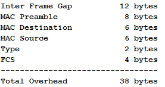
Почему при расчёте overhead размер служебных данных Ethernet берётся 14 байтов, а не 38 или 18 (Dest+Source+Legth+FCS).

Легко понять, почему в расчёт не идут Преамбула и IFG. Как вам известно Ethernet совмещает в себе функции канального и физического уровня модели OSI. И в то время, как MAC DST, MAC SRC, Type и FCS — являются атрибутами канального уровня, преамбула и IFG — физического. Логично, что при обработке кадра устройство ориентируется только на его полезную длину, без служебных байтов физического уровня. 
При этом заметьте, что при расчёте пропускной способоности, всё-таки учитывается полная длина: 38 байтов + полезная нагрузка.

Хорошо, но как быть с FCS? Ведь его чаще всего не учитывают при вычислении накладных расходов (overhead) и к длине полезной нагрузки добавляют только 14 байтов (MAC DST+MAC SRC+Type). 
Тут дьявол в мелочах и чтобы найти ответ, нужно обратиться к самой сути FCS — Frame Check Sequence. IP не имеет встроенных средств контроля целостности исходной информации, поэтому эти функции берут на себя TCP (общий контроль — все ли данные доставлены корректно) и Ethernet. Последний проверяет на повреждения каждый конкретный кадр, высчитывай контрольную сумму. То есть он берёт весь полностью кадр за исключением поля FCS, обрабатыавет его и сравнивает полученнй результат с исходным значением контрольной суммы, если не совпадает — отбрасывает. Если совпадает, сначала поле FCS снимается, затем оставшийся кадр передаётся вышестоящим инстанциям. Фактически эта обработка происходит в железе на самом раннем этапе и те процессы, которые занимаются собственно кадром и вычисляют его размер, получают на самом деле только 14 избыточных байтов заголовка.
Такая интересная арифметика.
forum.nil.com/viewtopic.php?f=12&p=582

### 5. Знаете ли вы, что реальная битовая скорость Fast Ethernet 125 Мб/с? Почему так?
Ethernet заимствует у FDDI метод кодирования 4B/5B, когда любые четыре бита MAC-подуровня представляются пятью физическими битами с чередующимися нулями и единицами. Для чего это делается — уже глубокая физика. 
При этом исходные данные должны передаваться со скоростью 100 Мб/с согласно стандарту Ethernet. Из-за этого избыточного бита действительная скорость на 25% больше (5 больше 4 на 25%), что составляет, разумеется, 125 Мб/c.
citforum.ru/nets/lvs/glava_5.shtml


### 6. Всем известно, что комитет 802 занимается стандартами по ЛВС. Также, общеизвестно, что Ethernet — это 802.3
С другой стороны сейчас общепринят стандарт Ethernet II.
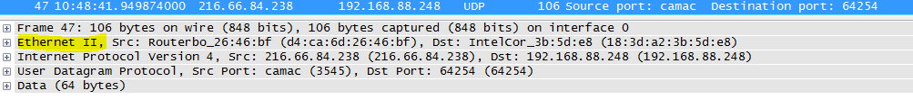


В чём же отличие кадров Ethernet II от кадров 802.3 и почему он вообще II?

О6: Кадры формата 802.3 содержат поле Length вместо привычного нам Type (EtherType). Исторически сложилось, что существует несколько стандартов для кадров Ethernet (помимо перечисленных). 
Потом DEC, Intel и Xerox доработали их до универсального красивого решения Ethernet II (Ethernet DIX по первым буквам компаний), которое стало экстремально популярным — IP работает именно поверх него.
Поле Length прежде говорило о общем размере полезной нагрузки, что было в общем-то мало информативно и тем более такой кадр мог нести только один тип вышестоящего протокола. Значения Length могут быть до 1500 (0x05dc). 
В кадре Ethernet II отказались от поля Length и осовобившиеся 2 байта использовали под поле Type (EtherType), которое определяет тип вышестоящего протокола. Чтобы чётко отличать их от 802.3 берутся значения, выше 1536 (0x0600). 
Так например, если кадр несёт IPv4, то тип будет 0х0800, ARP — 0x0806, VLAN (802.1q) — 0x8100, IPv6 — 0x86DD, QinQ — 0x9100 итд.
pascal.tsu.ru/other/frames.html#as-h4-2325214

Немного повыше поднимаемся


### 7. LACP применяется для управления интерфейсами в LAG. Сможет ли он отследить вот такую ситуацию
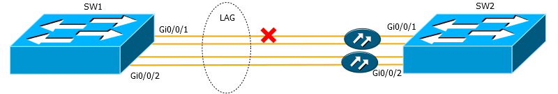

Здесь коммутаторы подключены двумя оптическими интерфейсами, объединёнными в LAG. В качестве среды используется два оптических кабеля — один для приёма, другой для передачи. Что произойдёт после обрыва одного кабеля?

Вообще говоря LACP — примтивнейший протокол. Он принимает решение о том добавить или удалить интерфейс из LAG практически лишь на основе того какое состояние у интерфейса — Up или Down. 
В случае обрыва только одного кабеля прекратится передача в одном направлении — исчезнет сигнал лазера. Как правило коммутатор, как только перестаёт видеть сигнал удалённой стороны, переводит интерфейс в сотояние Down. В ситуации, как на рисунке, SW2 сигнал видеть перестаёт, потому что кабель повреждён, и переводит интерфейс Gi0/0/1 в Down. В то же время SW1 сигнал видит и его интерфейс Gi0/0/1 в Up'е.

На SW2 LACP удаляет Gi0/0/1 из LAG, а на SW1 нет. Таким образом получается проблема с передачей данных.
Для избежания таких ситуаций необходимо воспользоваться одним из протоколов UDLD (UniDirectional Link Detection), например BFD или EFM OAM.
UPD: Пользователь Karroplan" внёс поправки в этот вопрос:
LACP прекрасно определяет unidirectional links. Тайм-аут либо 1, либо 30 секунд — есть два механизма в lacp, fast и slow transmission.
UDLD/BFD нужны только для уменьшения времени реакции. Более того, в свое время пришлось выпустить отдельный RFC по BFD поверх LACP, т.к. BFD изначально протокол L3 и воспринимает весь PortChannel как один агрегированный линк и может определить только падение всего линка.

Ещё выше


### 8. Смогут ли пинговать друг друга два компьютера в таких условиях
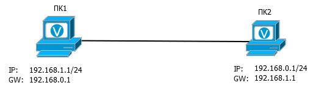

Да смогут. Несмотря на то, что шлюз по умолчанию находится в другой подсети, ARP-запросы будут отправляться в его поисках.
То есть ПК1 отправляет широковещательный ARP запрос «Кто тут 192.168.0.1?». ПК2 его получает и, естественно, отвечает, что это он и есть. ПК1 получает ARP-ответ и вносит его МАС-адрес и IP-адрес в свою таблицу. Далее ничего не препятствует им обмениваться данными.
UPD: Пользователь merlin-vrn дал более верный исчерпывающий ответ на этот вопрос:

Как компьютер ПК1 должен добираться до 192.168.0.1?

1. Смотрим, не локальный ли адрес это. Нет, не локальный.
2. Смотрим, не находится ли он в любой из локальных сетей (здесь 192.168.1.0/24). Нет, не находится.
3. Ищем шлюз и делаем ARP-запрос к нему. А через какой интерфейс? Оп-па. Где искать 192.168.0.1? Мы не знаем.

Скажете, что «раз указали в настройках сетевухи 1, значит через неё и искать». Хорошо. Это эквивалентно маршруту «192.168.0.1/32 via сетевуха1», что, собственно, и сделает винда.

Т.е. приведённая в примере конфиуграция, на самом деле, устроена так:
ПК1: 192.168.1.1/32, 192.168.0.1/32 via e0,
ПК2: 192.168.0.1/32, 192.168.1.1/32 via e0.

Т.е. у нас есть два компа и локальные маршруты «непосредственно» друг до друга, хоть оно и в разных подсетях. Конечно, будет пинговаться.
Суть в том, что перед тем как добавлять такой маршрут по умолчанию (не находящийся в той же подсети), нужно чтобы в таблице маршрутизации уже был к нему маршрут, которого, разумеется, изначально нет. Но Windows скрыто его добавляет, поэтому пинг работает.

### 9. В чём разница между Directed Broadcast (192.168.0.255) и Limited broadcast (255.255.255.255)

Пакет, отправленный на адрес 255.255.255.255 ограничен лишь той сетью, где он зародился — МАС-адрес выставляется в ffff-ffff-ffff. Если пакет отправляется на 192.168.0.255, то сначала согласно всем правилам маршрутизации пакет достигает сети назначения 192.168.0.0, а уже потом рассылается всем хостам в этой сети.

### 10 Может ли адрес 10.0.1.0 быть использован для адреса хоста?

Да, конечно, может, если например, на интерфейсе у вас применена конфигурация 10.0.0.0/23. Тогда диапазон доступных адресов будет 10.0.0.1-10.0.1.254 и все они могут быть использованы. В том числе 10.0.0.255.
UPD: Второй пример — использование маски /31, когда адрес сети и широковещательный адрес можно назначать узлам.


### 11. Чем принципиально отличается обратная маска от обычной?

Естественно, заметное отличие в инвертированности этой маски, то есть нулями обозначается та часть, которая должна быть неизменной. Но это не принципиально ведь.
Существенная разница в том, что здесь нули могут чередоваться с единицами. То есть если маска подсети не может содержать такой набор: 10110001, то обратная маска может. 

Таким образом вы, например, сможете выделить во всех подсетях хосты с адресом 10.5.Х.123, например, и разрешить им доступ в Интернет. Или отделить все чётные адреса от нечётных и реализовать распределение трафика ровно пополам на основе адреса отправителя.

UPD: Отличие заключается также в том, что прямая маска оперирует сетями, а обратная — хостами.

### 12. Для чего нужны адреса 169.254.0.0/16 (автонастройка APIPA в Windows и nonzeroconf в unix)
И почему такой пинг не работает:
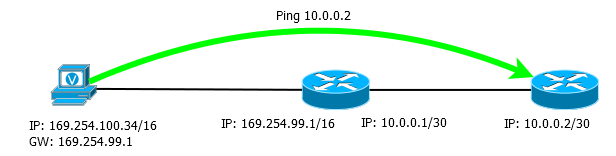

Сеть 169.254.0.0/16 была изначально задумана как сеть Link-Local.
Суть её заключается в том, что, если хост не имеет статического IP-адреса и не может получить его автоматически, например, от DHCP-сервера, то он сам себе назначает адрес из диапазона 169.254.0.1-169.254.255.254. После этого он сможет общаться с другими хостами в этой сети, имеющими такие же адреса.
Адрес выбирается случайным образом благодаря генератору случайных чисел так, чтобы он не совпал с уже существующим адресом (проверяется ARP-запросом).
Примером применения может быть какая-нибудь Ad-Hoc сеть, где у станций задача — общаться между собой.

Но ключевая особенность такой сети в том, что взаимоотношения возможны только между станциями, находящимися в этом сегменте, отсюда и фраза Link-local в определении. Пакеты не могут передаваться дальше маршрутизатора. Более того, даже если у хостов будет указан адрес шлюза, по стандарту он не должен на него передавать пакеты ни при каких условиях.
Этим и объясняется то, что пинг, как на рисунке не работает. Всё согласно RFC.

### 13. А знаете ли сколько всего адресов пропадает, кроме известных всем приватных и 127/8?

На самом деле мы теряем:
Одну сеть класса А: 127.0.0.0/8
Одну сеть Класса В: 169.254.0.0/16
Одну сеть /10: 100.64.0.0/10
Одну сеть /15: 198.18.0.0/15
Пять сетей класса C: 192.0.0.0/24, 192.0.2.0/24, 192.88.99.0/24, 198.51.100.0/24, 203.0.113.0/24.
И одну сеть /4: 240.0.0.0/4

Итого 285410560 адресов.

Вот такие мы расточительные.


Почему во время трассировки могут быть такие ситуации


### 14. На одном из хопов по всем трём результатам трассировки величина задержки выше, чем на следующем

[eucariot]$ traceroute 8.8.8.8

traceroute to 8.8.8.8 (8.8.8.8), 30 hops max, 40 byte packets

...

6 vl545.mag02.lon01.atlas.cogentco.com (149.6.3.153) 11.464 ms 11.378 ms 11.347 ms

7 te0-7-0-5.ccr21.lon01.atlas.cogentco.com (154.54.74.109) 5.653 ms 4.725 ms 6.209 ms

8 te3-2.ccr01.lon18.atlas.cogentco.com (154.54.62.66) 4.951 ms te2-1.ccr01.lon18.atlas.cogentco.com (154.54.61.214) 5.050 ms te3-2.ccr01.lon18.atlas.cogentco.com (154.54.62.66) 5.086 ms


14: Если такая задержка единичная, то, скорее всего, это вопрос буфферизации/приоритезации. Например, временная перегрузка на линии. 
UPD: Пользователь JDima внёс дополнения по этому вопросу:
Коротко: 
На хардварных платформах отправка отклика time exceeded реализована на совершенно других чипах, нежели передача транзитных пакетов.

Длинно: 
Возьмем к примеру мой любимый Cat6500. Его «мозги» (то, что отзывается на пинги, обменивается маршрутами, принимает ssh соединения и т.д.) сосредоточены на супервизоре в MSFC. MSFC отвечает за программирование PFC (ну и DFC при их наличии), в котором и осуществляется обработка и передача пакетов. По хорошему, ни один транзитный пакет не должен попадать в MSFC.
Пакет с TTL 0 не может быть обработан PFC, так как тут требуется более интеллектуальная обработка, чем та, на которую он способен (требуется сгенерить time exceeded и отправить его назад отправителю (или вперед получателю в случае MPLS, да не суть)). Потому такой пакет переадресуется MSFC. А тот может в данный момент быть нагружен, ICMP на нем не в приоритете, потому он может на несколько миллисекунд отложить отправку ответа, пока не закончит с более важными делами.

Гораздо интереснее ситуация, когда такие результаты повторяются. Мы прекрасно понимаем, что 3 пролёта, например, пакет не может проходить быстрее, чем 2. Так в чём же дело?
А дело в том, что трассировка показывает только прямой путь от нас до интересующего сервера. При этом мы ничего абсолютно не знаем об обратном пути. Как бы мы этого ни хотели, узнать обратный путь можно, только отправив трассировку в обратную сторону.
Но, несмотря на это, задержка по сути — это Round Trip Timer, то есть время пути пакета туда и обратно.

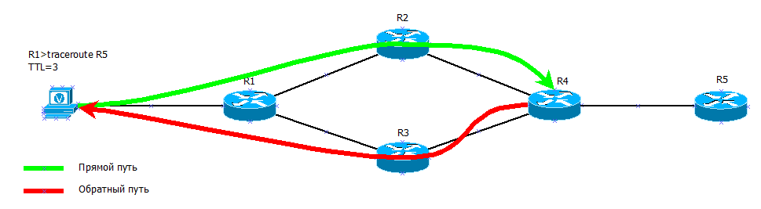

Таким образом при TTL=3 пакет попадает на R4 одним путём, а возвращается другим. А R3 — это слабенькая старенькая 26-ая циска, которая уже загибается и не может пропихнуть 90 Мб/с. В итоге там случается перегрузка и именно на обратном пути возрасает задержка.
Зато, когда traceroute посылает следующий тестовый пакет с TTL=4 обратно он идёт тем же путём и задержка нормализуется. 
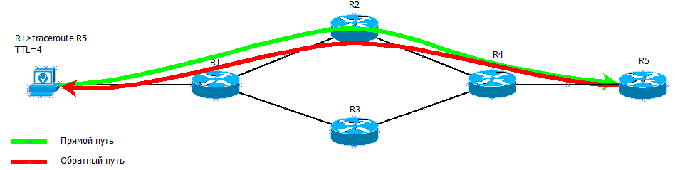


### 15. Иногда в трассировке появляются серые адреса (в середине или как последний хоп). Как так, ведь они не маршрутизируются в Интернете?
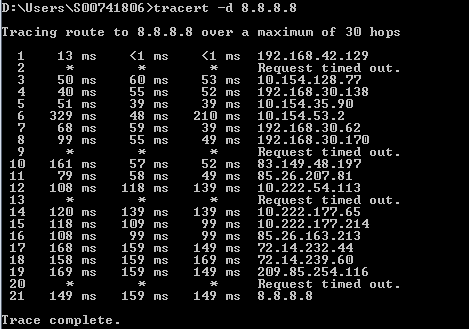
Согласно RFC такие адреса действительно не маршрутизируется в глобальном интернете, но речь идёт о маршрутизации между AS.
При этом, если где-то в сети провайдера, один из маршрутизаторов будет подключен через приватные адреса, то такая ситуация становится возможной. Дело в том, что маршрутизатор должен в ответном сообщении TTL expired установить в качестве адреса отправителя адрес того интерфейса, на который пришло изначальное сообщение от traceroute. 
Станция, с которой запускался трейс покажет именно этот адрес.

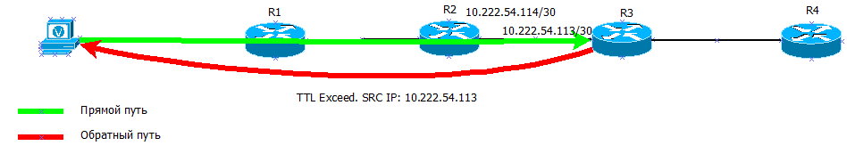

И в такой ситуации вы как раз увидите приватный адрес.

### 16. Чем обусловлены такие задержки при трассировке?
1. te2-4 PAO2 bl (69 22 1 3 209) 1 160 1 060 1 029 4.ar5.PAO2.gblx.net (69.22.153.209) 1.160 ms 1.060 ms 1.029 ms
2. 192.205.34.245 (192.205.34.245) 3.984 ms 3.810 ms 3.786 ms
3. tbr1 sffca ip att net (12 123 12 25) 74 848 ms 74 859 ms 74 936 ms tbr1.sffca.ip.att.net (12.123.12.25) 74.848 ms 74.859 ms 74.936 ms
4. cr1.sffca.ip.att.net (12.122.19.1) 74.344 ms 74.612 ms 74.072 ms
5. cr1.cgp ( ) cil.ip.att.net (12.122.4.122) 74.827 ms 75.061 ms 74.640 ms
6. cr2.cgcil.ip.att.net (12.122.2.54) 75.279 ms 74.839 ms 75.238 ms
7. cr1.n54ny.ip.att.net (12.122.1.1) 74.667 ms 74.501 ms 77.266 ms
8. gbr7.n54ny.ip.att.net (12.122.4.133) 74.443 ms 74.357 ms 75.397 ms
9. ar3.n54ny.ip.att.net (12.123.0.77) 74.648 ms 74.369 ms 74.415 ms
10.12 126 0 29 (12 126 0 29) 76 104 76 283 76 174 12.126.0.29 (12.126.0.29) 76.104 ms 76.283 ms 76.174 ms
11.route-server.cbbtier3.att.net (12.0.1.28) 74.360 ms 74.303 ms 74.272 ms

Это явный указатель на то, что трассировка прошла сквозь MPLS-сеть.
В такой сети, когда используется коммутация на основе меток MPLS, а не IP-адресов, трассировка ведёт себя кардинально иначе. 
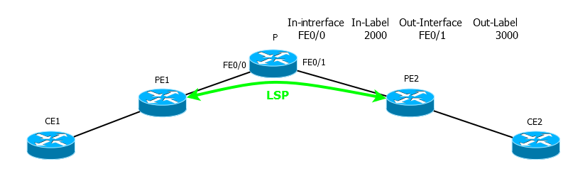

Вот допустим с CE1 запускаем трассировку на CE2. Между PE1 и PE2 установлен LSP.
И вот CE1 отправляет пакет с TTL=2. Он доходит до маршрутизатора P с MPLS-меткой, например 2000. TTL к этому времени равен 1, P уменьшает его и понимает, что оригинальный пакет нужно выбросить, а вместо него отправить TTL-expired на адрес CE1. Он подготавливает ICMP-пакет, в качестве получателя ставит CE1, НО! согласно таблице меток MPLS метка 2000 должна быть заменена на 3000 и соответственно, пакет отправлен на интерфейс FE0/1. То есть в сторону обратную от получателя.
Пакет долетает до РE2, который раздевает его и отправляет на СЕ2 уже чистый IP. 
СЕ2 благополучно согласно своей таблице маршрутизации отправляет этот пакет назад в MPLS сеть.
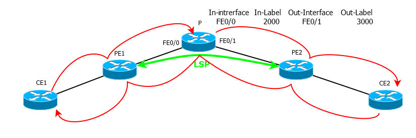

То есть несмотря на то, что пакет должен был пролететь 2 хопа и вернуться, он прошё весь путь от источника до получателя и назад.
Аналогично при TTL=3, после PE2 пакет сначала передаётся на СЕ2 вместо того, чтобы сразу вернуться на СЕ1 — снова проходит весь путь.
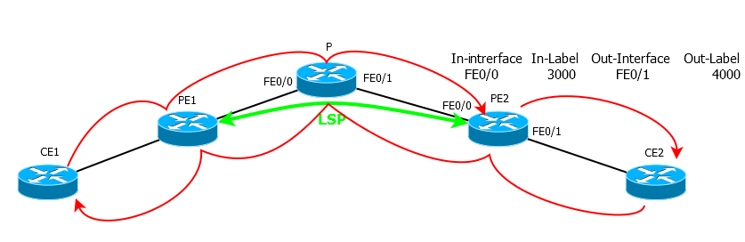


Именно поэтому на всех практически хопах задержки оказываются примерно одинаковыми — путь-то они прошли один.

UPD: На рисунке и в описании ошибка, «разворачивает» пакет TTL exceed уже РЕ2, до СЕ он не доходит.


### 17. При пинге с маршрутизатора cisco теряется первый пакет. Почему это происходит?

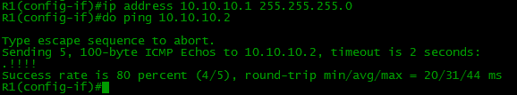

Принято считать, что маршрутизатор отправляет ICMP-запрос и, не получив ICMP-ответ, рисует точку. А ICMP-ответа нет, мол потому, что удалённое устройство должно сначала изучить ARP.
Заблуждение! Его легко проверить включив дебаг или собрав дамп с интерфейса:
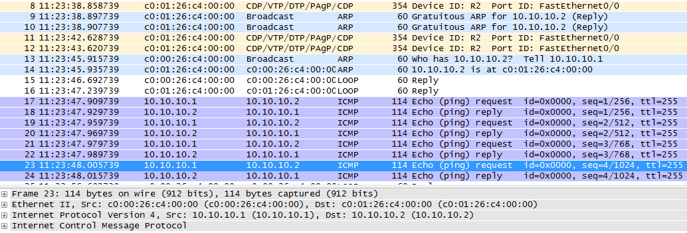

Как видите, на самом деле первый ICMP-запрос не отправляется вовсе. ARP улетел и прилетел, а ICMP отброшен. Это видно по тому, что всего 4 ICMP-запроса и 4 ответа.
blog.ipspace.net/2007/04/why-is-first-ping-lost.html

### 18. Известно, что в качестве приватных подсетей были выбраны сети из разных классов: A, B, C. Но почему имено 10/8, 172.16/12, 192.168/16?
Я бы, наверно, так и не нашёл ответ на этот вопрос — тема совершенно не освещена ни в рунете, ни в большом Интернете. Но мой коллега подошёл к этому радикально. Он написала два письма в IANA.
Dear YYY,

Thanks for contacting us.

We do not have the answer to your question and suggest you contact the authors of «Address Allocation for Private Internets» (RFC 1597), the document first setting these ranges aside. You can find details about the document here: www.rfc-editor.org/info/rfc1597

Kind regards,

Но людям из 1597 он уже писал) там уже адреса не валидные.
А вот второе письмо оказалось более результативным:
Dear YYY,

Thank you for your inquiry.

For more information about the private use space, see www.rfc-editor.org/rfc/rfc1918.txt.

As to why those specific blocks were chosen, we believe 10/8 was chosen because sri-nic.arpa (10.0.0.51) was embedded in pretty much every unix and multics system as the hardcoded source of hosts.txt and various other files. For the others, the decision was made that since a class A was allocated, there should be blocks of class Bs and Cs too. It could just be that those blocks were available. 

Hope that helps.

Best regards,

Michelle Cotton
Manager, IANA Services
ICANN


В общем-то исчерпывающий ответ. Больше искать правду негде.

Неотвеченными остался только один интересный, но, возможно, надуманный вопрос. Как я его ни крутил, как ни гуглил, но его тайна пока не раскрыта.

Для чего нужен адрес сети? Почему его нельзя назначить хосту?
Логичный первый вариант — он определяет сеть. Ну а что, так уж нужен для этого отдельный адрес? 192.168.1.110/24 определяет сеть точно так же хорошо, как и 192.168.1.0/24. Да и это всё равно не мешает назначать этот адрес хосту. 
Вторая идея — так прописываются маршруты на роутерах. Это же не более, чем условность, ведь по сути см. первый вариант.
Встречал я также описание того, что некоторые вендоры преобразуют пинг на адрес сети в широковещательный кадр, но какой в этом смысл?

Если вы мне скажете, что так просто решили формализовать сеть, то я, видимо, обречённо приму. 

Симметричный вопрос:
Или для чего нужен широковещательный адрес? Можно было бы использовать для него адрес сети.

UPD На данный вопрос приблизительный ответ дал один из читателей:
По последнему вопросу, у Дугласа Комера в 4 издании «Interworking with TCP/IP» есть соответствующая глава. Нули в последнем октете не более чем соглашение, никакой технической подоплёки в этом нет. Там же указывается, что в раннем программном обеспечении протоколов в UNIX'ах пользовались инвентированным соглашением, т.е. для обозначения сети использовали единицы (192.168.1.255/24), а для широковещания — нули, но в последствии этот условный «баг» исправили.
По поводу маршрутизаторов. Они не хранят пути в табличном виде, а используют, например, дерево для эффективного поиска маршрута. Так зачем хранить ненужные листья, если они все равно не будут просматриваться? (Маршрутизатор будет продвигаться по дереву 192.168.1/24, а не по 192.168.1.110/24)

***
# Linux вопросы:

####  1. Классика, назовите 6 шагов загрузки Linux. 


####  2. Нормальный load average на сервере виртуального хостинга колеблется от 0 до 2. Load average резко увеличивается до 50. Как понять причину повышения нагрузки? Напишите команды для анализа проблемы и вероятные причины начиная с самой вероятной.
-Можно проверить различными командами top/atop/htop/iotop и df -h
- LA  может подниматься не обязательно изза нагрузки на ЦП, так же возможно изза просадки  HDD,
плюс нагрузка на сеть и на выходе высокий LA.
Для меня сейчас более информативная утилита glances, можно увидеть нагрузку на диски и на сеть, и какую
нагрузку  дают контейнеры. https://github.com/nicolargo/glances 
- Если нагрузку дает приложение тот же apache, я бы начал с логов и посмотрел нагрузку на сеть.
Потом через мод статус посмотрел на какой сайт идет атака и уже дальше можно действовать изходя из информации.
Скорее всего на сервере уже прописаны корректные переменные sysctl и другие механизмы защиты, и поправлен конфиг апача.
Более подробно думаю нет смысла расписывать так как это выходит за рамки вопроса.
- Часто нагрузку может выдавать mysql, когда селект идет уже более 6 часов
с приходом mysql8 когда myisam удалили проблем будет меньше, так как при падении
при грамотной настройке сервер поднимется сам правда если данных было много будет долгий процесс.
- Бывает и DNS Amplification атака и нагрузка идет на хост, лечится добавлением доворенных днс адресов.
Встречал такую атаку и на свой маршрутизатор домашний Mikrotik RB2011UiAS-2HnD-IN.
Решается правильной настройкой фаерволла. 
-И так же нагрузку может создавать почтовый сервер, взломали почтовый ящик и рассылают спам.
Помогут нам логи  и поиск скриптов если еще и взломан сайт был.
- Нагружает tar, gzip.
Возможно пользователь решил сделать бекап.
- Может еще быть такой кейс, пользователь залил свой софт и он грузит ЦП и память и сеть.
Решил устроить ботнет.

####  3. Каким образом можно гарантированно ограничить каждого пользователя виртуального хостинга от выедания им всех ресурсов cpu и памяти linux сервера, учитывая что mod_php/mod_perl не установлены?
- Я предпологаю тут вопрос про конфигурацию  /etc/security/limits.conf 
Там же есть комментарии в файле. Проверить ограничения можно по команде ulimit -a

####  4. Какие методы для борьбы с исходящим спамом через web скрипты и sendmail существуют в mta postfix и exim? Spamassasin и другие спамфильтры рассматривать не нужно.

- в postfix есть несколько параметров, ограничивающих количество отправленных писем
anvil_rate_time_unit = 60s
smtpd_client_message_rate_limit = 10
При данных параметрах с одного ящика можно отправить не более 10 писем за 60 секунд.
smtpd_client_connection_rate_limit = 6 — Количество соединений с одного IP адреса. Если он превышен пользователь получит сообщение «Too many connections from ip»
- Я бы искал спамеров как вариант ниже
grep ‘uid=’ /var/log/mail.log | awk -F ‘uid=’ {‘print$2’} | awk {‘print $1’} | sed ‘s/,//g’ | sort | uniq -c | sort -n | tail -5 | awk {‘print “UID:”,$2,”MESSAGES COUNT:”,$1’}

- Настройка Exim для противодействия распространению спама
- host_reject. Данная опция задается в конфигурационном файле exim.conf.
Ее значение представляет собой список имен узлов и доменов, а также IP-адресов, разделенных двоеточиями.
Почта, переданная с компьютеров, указанных посредством данной опции, должна блокироваться.
Например, запись host_reject = *.spammer.net:11.11.11.0/24 указывает на то, что письма
из домена spammer.net, а также из сети 11.11.11.0/24 должны отвергаться. 
- host_reject_recipients. Данная опция действует так же, как host_reject, но почтовые сообщения отвергаются
лишь в процессе взаимодействия с удаленной программой, в частности, в тот момент,
когда она передает команду RCPT TO:. В результате попытки пересылки писем немедленно прекращаются.
- sender_reject. Данная опция блокирует письма от указанных отправителей. Роль отправителя может выполнять
либо целый домен, либо отдельный пользователь в домене.
- sender_reject_recipients. Данная опция действует подобно опции sender_reject,
но взаимодействие с удаленным компьютером прекращается после того, как выполняющаяся на нем программа
укажет адрес получателя, т.е. передаст команду RCPT TO:.
- Можно использовать свои фильтры .forward, находящиеся в рабочих каталогах пользователей.
- Если вам необходимо задать длинный список отправителей, письма от которых не должны приниматься, вы должны указать их в отдельном файле, а ссылку на этот файл задать в качестве значения соответствующей опции. Помимо перечисленных выше средств, в сервере Exim также предусмотрен ряд опций, предназначенных для работы со списками IP-адресов. Эти опции, располагающиеся в файле exim.conf, кратко описаны ниже.
• rbl_domains. Значением этой опции является перечень адресов серверов, 
поддерживающих списки IP-адресов 
• rbl_hosts. По умолчанию принимается значение * данной опции; оно указывает на то,
что сервер должен проверять все узлы, с которыми он взаимодействует, на соответствие спискам IP-адресов,
указанных посредством опции rbl_domains.
-Там есть и другие параметры с rbl_ И как обычно логи все покажут если их не удалили, и настроена ротация логов.
-Есть такой кейс как https://rspamd.com/ написан на плюсах, не ест память как спамассасин и вебморда со статистикой.

####  4. Как организовать ежедневное резервное копирование сервера виртуального хостинга создавая при этом минимум нагрузки на него, учитывая, что он содержит около 10-ти миллионов файлов, а общий объем данных около 300Гб?
- Бэкап данных с btrfs и LVM bash скриптами, аналогичный вариант может быть и на ZFS
- Бекапы могут сливаться по NFS на сервер бекапов.
- Есть более централизованное решение https://github.com/bareos/bareos с бекендами, шифрованием и управлением.

####  5. На одного из клиентов виртуального хостинга направлена DDOS атака. Ваши действия по его предотвращению? Какими командами вы будете пользоваться для обнаружения DDOS атаки? Как можно настроить linux сервер так, чтобы воздействие ddos атаки на одного клиента минимально сказалось на общей производительности и доступности сервера?
Виды атак DDOS атак.Приведем список потенциальных типов атак и их классификацию.
- Переполнение канала:
- DNS амплификация и флуд
- NTP амплификация и флуд
- ICMP флуд и фрагментированный ICMP-флуд
- Ping флуд
- UDP флуд и флуд с помощью ботнета, фрагментированный UDP флуд
- VoIP флуд
-  Флуд медиа-данными
- Атака широковещательными ICMP ECHO пакетами и UDP пакетами

Атаки на уязвимость сетевых протоколов:
- Атаки с модификацией поля TOS
- ACK / PUSH ACK флуд
- RST/FIN флуд
- SYN и SYN-ACK флуд
- TCP null/ IP null атака
- Атака поддельными TCP сессиями, в том числе с несколькими ACK
- Атака с подменой адреса отправителя адресом получателя
- Атака с помощью перенаправления трафика высоконагруженных сервисов
- Ping смерти

Атаки на уровне приложений:
- HTTP флуд, одиночными запросами, одиночными сессиями
- Атака с целью отказа приложения
- Атака фрагментированными HTTP пакетами
- Сессионная атака. Атака медленными сессиями
- DDoS атаки “нулевого” дня

Переполнение канала, нужно фильтровать на уровне оборудования перед хостом,
остальные атаки можно отразить сервером.
Начнём узнаем что не так с сервером.

Посмотрим количество процессов Apache:
- ps aux | grep httpd |wc -l
Узнаем число подключений на 80 порт:
- netstat -na | grep :80 | wc -l
То же, в статусе SYN
- netstat -na | grep :80 | grep syn
SYN-флуд:
- netstat -na | grep :80 | grep SYN | wc -l 767
Посмотрим количетсво разных IP:
- netstat -na | grep :80 | grep SYN | sort -u | more
Узнаем на какой домен чаще всего идут запросы:
- tcpdump -npi any port domain
Узнаем информацию о  IP или домене Linux:
- whois xxx.xxx.xxx.xxx
С какого IP сколько запросов:
- netstat -na | grep :80 | sort | uniq -c | sort -nr | more
Вывод информации в реальном времени, IP которые соединены с сервером и
какое количество соединений по каждому IP
- netstat -anp |grep 'tcp\|udp' | awk '{print $5}' | cut -d: -f1 | sort | uniq -c | sort -n

Логи Логи Логи...
- iptables -A FORWARD -p tcp -s <атакуемый IP> --dport 80 -j REJECT и не забыть потом разблочить

Сервер уже должен быть настроен, затюенно ядро и фаерволл и догда сайт точно не ляжет от LOIC.
Лучший вариант отказаться от апаче, если нет вомзожности то связка nginx + апач. С правильными настройками,
на таймауты и буферы.

Кстати на nginx есть код 444 который может помочь и уберечь от нагрузки.
```
location /search {
   return 444;
}
```
И банить из лога он должен быть стандартный combined.

```
ipset -N ban iphash
tail -f access.log | while read LINE; do echo "$LINE" | \
    cut -d'"' -f3 | cut -d' ' -f2 | grep -q 444 && ipset -A 
    ban "${L%% *}"; done
```  
####  6. На OpenVZ ноде LA достигает 300. Как понять причину повышения нагрузки? Напишите команды для анализа проблемы и вероятные причины начиная с самой вероятной.
Обычно 99% проблем с дисками, диски тормозят, httpd плодятся и все виснет.
Посмотрел бы сеть  на  подключения может быть DDOSят непосредственно сам apache - устанавливают кучу коннектов на его портнашел бы впс которая  нагружает vzlist -Ho ctid,laverage можно посмотреть htop что грузит и найти vzpid 123456 и узнаем что за процесс.
пример
```
Pid      CTID   Name
123456 11239   httpd
```
####  7. Какова максимальная производительность Linux маршрутизатора? В чем она измеряется и от чего зависит?
все маршрутизиторы упираются в процессор, если пакеты сдорые и их нужно фрагментировать или наооброт они просто ходят огромными, то может встать все. еще если юзается  arp proxy, тоже может прилечь рутер.

####  8. Как смигрировать Xen domU с одной ноды на другую с минимальным даунтаймом при условии что общее дисковое хранилище не используется и в качестве виртуальных дисков используется lvm? Опишите несколько вариантов.
XEN имеет встроенную возможность перемещать гостей DomU между несколькими узлами Dom0 без остановки их работы, что называется live migration. Понятное дело, для этого нужно, чтобы на всех узлах, между которыми перемещаются гости, были актульные копии их дисков. Тут может быть масса вариантом, например общая СХД, подключенная ко всем узлам(fiber, sas, iscsi и т.д.), либо дешeвый вариант с использование DRBD.

####  9. Расскажите какие знаите системы мониторинга на linux.
NAGIOS, Zabbix, CACTI, Munin
Отдельно стоит упоминуть NETDATA

####  10. Напишите структуру каталогов Unix-подобных систем, в каком каталоге можно просмотреть логи сервера?
Примерная структура каталогов:
- / - корневой каталог.
- /bin - основные системные программы.
- /boot - загрузочные файлы ядра ОС.
- /dev - описания устройств компьютера.
- /etc - конфигурационные файлы системы и подкаталоги с конфигурационными файлами прикладных программ.
- /home - подкаталоги (домашние каталоги) пользователей.
- /lib - динамические библиотеки.
- /lost+found - информация об удаленных файлах, при некоторых условиях помогающая восстановить данные.
- /mnt - подкаталоги стандартные точки монтирования сменных устройств, таких как дисковод CD-ROM.
- /root -домашний каталог суперпользователя.
- /sbin - системные программы.
- /usr - прикладные программы и библиотеки.
- /var -рабочие каталоги программ.
- Логии сервера можно просмотреть в каталоге /var/log

#### 11. Какие демоны  Unix-подобных систем вы знаете?
Ответ:
- Демоны Unix-подобных систем:
- Демон cron: планирование команд
- Демон inetd: управление демонами
- Демон sendmail: транспортировка электронной почты
- Демон snmpd: сервер управления сетями
- Демон nfsd: файловый сервис
- Демон rpc.mountd: ответы на запросы монтирования
- Демон routed: ведение таблиц маршрутизации
- Демон gated: ведение сложных таблиц маршрутизации
- Демон named: сервер DNS
- Демон ftpd: сервер пересылки файлов

# Windows вопросы:

#### 1.  Расскажите своими словами, что такое «MASTER BROWSER» для локальной сети.
Master browser – компьютер, который содержит у себя список компьютеров локальной сети, список открытых сетевых ресурсов этих компьютеров (общих папок, принтеров).Его задача – выдавать этот список, в ответ на широковещательные запросы остальных компьютеров.

#### 2. Каки службы нужны для установки и нормального функционирования ACTIVE DIRECTORY.
Для развертывания Active Directory необходимо чтобы на этом сервере была установлена и сконфигурирована служба DNS-сервера. Если данной службы нет – при установке Active Directory она будет установлена и сконфигурирована самим инсталлятором.

#### 3. В каких режимах может работать встроенный сервер терминалов в MICROSOFT WINDOWS SERVER?
Для развертывания Active Directory необходимо чтобы на этом сервере была установлена и сконфигурирована служба DNS-сервера. Если данной службы нет – при установке Active Directory она будет установлена и сконфигурирована самим инсталлятором.
Сервер терминалов в Microsoft Windows Server 2003, 2008 может работать в двух режимах:
- Режим администрирования – доступны два бесплатных одновременных подключения;
- Режим приложений – на каждое подключение необходимо покупать отдельную клиентскую лицензию для сервера терминалов.

#### 4. Что такое  ActiveDirectory
ActiveDirectory — LDAP-совместимая реализация интеллектуальной службы каталогов корпорации Microsoft для операционных систем семейства Windows NT. ActiveDirectory позволяет администраторам использовать групповые политики (GPO) для обеспечения единообразия настройки пользовательской рабочей среды, развёртывать ПО на множестве компьютеров (через групповые политики или посредством MicrosoftSystemsManagementServer 2003 (или SystemCenterConfigurationManager)), устанавливать обновления ОС, прикладного и серверного ПО на всех компьютерах в сети (с использованием WindowsServerUpdateServices (WSUS); SoftwareUpdateServices (SUS) ранее). ActiveDirectory хранит данные и настройки среды в централизованной базе данных. Сети ActiveDirectory могут быть различного размера: от нескольких сотен до нескольких миллионов объектов.
(или "служба каталогов" по-русски) - это огромное хранилище, которое может хранить разную информацию о пользователях, компьютерах, принтерах и вообще еще много всего; это основное, что нам понадобится для дальнейшей работы. Каждая единица, хранящаяся в AD, называется объектом, причем служба также хранит и информацию о самом объекте и его свойствах, и называется это атрибуты объекта. Для доступа к службе существует специальный протокол LDAP.

#### 5. Чтотакое  LDAP
LDAP (англ. LightweightDirectoryAccessProtocol — «облегчённый протокол доступа к каталогам») — это сетевой протокол для доступа к службе каталогов. LDAP — относительно простой протокол, использующий TCP/IP и позволяющий производить операции аутентификации (bind), поиска (search) и сравнения (compare), а также операции добавления, изменения или удаления записей.

LDAP (LightweightDirectoryAccessProtocol - простой протокол доступа к каталогам), который и определяет способы доступа и обращения между клиентом и сервером AD. Здесь для каждого объекта есть его собственное особенное имя, с помощью которого и можно различать, что перед нами находится, данные о пользователе или же компе. Причем это имя помогает найти путь в AD, где этот объект лежит. У имени есть две основных части - CN (commonname - общее имя) и DC (domaincomponent- доменный компонент). CN показывает на объект или место, где он лежит, а DC говорит о домене, к которому относится объект. Вот, например, имя CN=Vasilii,CN=Guests,CN=Accounts,DC=subdomain,DC=domain,DC=yes говорит о том, что пользователь Василий лежит в контейнере гостей, который, в свою очередь, лежит в контейнере аккаунты, и все это относится к домену subdomain, причем он является поддоменомdomain, входящим в домен yes %). Вот так все запутано, но на деле выглядит гораздо проще и понятнее, о чем мы поговорим дальше. А в глобальном смысле AD делится на леса, деревья, домены и OU (OrganizationUnit - организационная единица), то есть полная аналогия с реальной природой, где домены представляются ветками, объединение доменов - дерево и скопище деревьев - лес. Но это обычно требуется в больших организациях, нам же хватит и одного домена, который по совместительству будет являться и деревом, и лесом :). Короче говоря, хватит лирической теории, будем осваивать все это дело на практике.

#### 6. Что такое WINS
WINS (англ. WindowsInternetNameService) — cлужба сопоставления NetBIOS-имён компьютеров с ip-адресами узлов.


#### 10. Что делает команда CHKDSK.EXE. Назовите известные вам ключи этой команды.
 Данная команда проверяет указанный диск на наличие ошибок и при необхо-
димости исправляет их. Команда также помечает поврежденные сектора и восста-
навливает данные, которые удается прочитать.
Использование:
- chkdsk.exe имя_диска:без параметров выводит сведения о состоянии текущего диска;
- /f — полная проверка указанного диска и исправление найденных ошибок.
- /r — поиск поврежденных секторов и попытка восстановления данных, которые можно прочитать. (при использовании этого параметра, система требует, чтобы параметр 
- /f тоже был указан).

#### 11. Что делает команда SFC.EXE? Назовите известные вам ключи этой команды.
Утилита командной строки sfc.exe - предназначена для проверки всех версий защищённых системных файлов и восстановления их из специального кэша (папка %Каталог Windows%c\system32\dllcache) в случае подмены или повреждения.
 Запуск возможен только с правами администратора.
Ключи:
- /scannow - немедленная проверка всех защищённых системных файлов;
- /scanonce - проверка защищённых системных файлов при следующей загрузке системы;
- /scanboot - проверка всех защищённых системных файлов при каждой загрузке системы;
- /revert - восстановление всех настроек по умолчанию;
- /purgecache - очистка кэша защищённых файлов программы и немедленная проверка всех защищённых системных файлов;
- /cachesize=х - установка размера кэша защищённых файлов в мегабайтах (по умолчанию — 50Мбайт)

#### 13. Что делает команда FIXBOOT.EXE?
Эта команда служит для записи нового кода загрузочного сектора Windows в системный раздел. 
Использование:
fixboot имя_диска.
Имя_диска — диск, на котором будет записан загрузочный сектор. Данная команда 
исправляет повреждения в загрузочном секторе Windows.
Доступна только в консоли восстановления Windows.

# DNS Технологии и рассылки

#### 1. Расскажите подробно про DKIM
DKIM (DomainKeys Identified Mail) — это метод e-mail аутентификации, основанный на проверке подлинности цифровой подписи. Публичный ключ хранится TXT записи домена.

#### 2. Расскажите про SPF
SPF (Sender Policy Framework) — расширение для протокола отправки электронной почты через SMTP. SPF определен в RFC 7208. По простому SPF — механизм для проверки подлинности сообщением, путем проверки сервера отправителя. 

#### 3. Расскажите про DMARC
Domain-based Message Authentication, Reporting and Conformance (идентификация сообщений, создание отчётов и определение соответствия по доменному имени) или DMARC — это техническая спецификация, созданная группой организаций, предназначенная для снижения количества спамовых и фишинговых электронных писем, основанная на идентификации почтовых доменов отправителя на основании правил и признаков, заданных на почтовом сервере получателя. То есть почтовый сервер сам решает, хорошее сообщение или плохое (допустим, исходя из политик выше) и действует согласно DMARC записи.

#### 4. Расскажите про PTR запись
PTR-запись - это запись в DNS, которая служит для связи IP-адреса сервера с каноническим именем этого сервера. Зачастую в PTR-записи указывается используемое на сервере доменное имя.

#### 5. Расскажите своими словами, что такое запись MX 
- Запись MX (mail exchanger) — тип записей в DNS-зоне домена, которые указывают какой сервер будет принимать всю почту, предназначенную для данного доме-
на.
- MX-записей может быть несколько, каждая имеет свой порядковый номер, который 
определяет приоритет доставки почты. Чем меньше номер, тем выше приоритет.
Знание такого понятия как MX, позволяет более тонко и безопасно настраивать почтовую систему компании. Например, можно первым MX-сервером назначить собственный почтовый сервер компании, вторым – сервер на колокейшене, третьим – сервер хостинг- провайдера. В подавляющем большинстве случаев, такая схема обеспечивает отказоустойчивую работу почтовых сервисов


# Виртуализация KVM, OpenVZ, XEN и Docker

#### 1. Что такое Docker?
Docker - ПО для автоматизации развёртывания и управления приложениями в среде виртуализации на уровне операционной системы. Позволяет «упаковать» приложение со всем его окружением и зависимостями в контейнер, который может быть перенесён на любую Linux-систему с поддержкой cgroups в ядре, а также предоставляет среду по управлению контейнерами.
#### 2. Что такое Docker-compose?
Docker-compose это простой инструмент, который позволяет настроить и запустить несколько контейнеров одной командой. 
Вся конфигурация для docker-compose описывается в файле docker-compose.yml


#### 1.
#### 1.
#### 1.
#### 1.
#### 1.

# FreeBSD вопросы:

# VOIP, SIP, Asterisk

# Ngnix, Letsencrypt & php

#### 1. Блокировка скрытых файлов в Nginx
Заблокировать такого типа файлы можно правилом:
location ~ /\. {
	deny all;
}


# Mysql, Postgresql, MongoDB, SSDB, Redis
