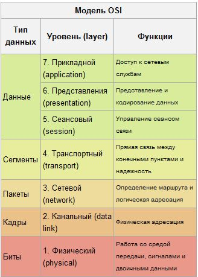

Спрос на спецов по ИБ растет, в соответствии с ростом технологий, а с ними и угроз, а также с вступлению в силу все новых федеральных законов, постановлений правительств и различных требований регуляторов. В связи с этим попытаемся определить самые распространенные вопросы на собеседованиях на вакансии специалиста по защите информации / информационной безопасности. Сразу отметим, что вопросы будут приведены для всех векторов в совокупности (бумажники, проектанты, администраторы ИБ и тд.). Итак начнём:

---

---

1. Модель OSI, уровни, протоколы, порты.

1 уровень. Физический (physical). Единицей нагрузки (PDU) здесь является бит. Кроме единиц и нулей физический уровень не знает ничего. На этом уровне работают провода, патч панели, сетевые концентраторы (хабы, которые сейчас уже сложно найти в привычных нам сетях), сетевые адаптеры. Именно сетевые адаптеры и ничего более из компьютера. Сам сетевой адаптер принимает последовательность бит и передает её дальше.
2 уровень. Канальный (data link). PDU - кадр (frame). На этом уровне появляется адресация. Адресом является MAC адрес. Канальный уровень ответственен за доставку кадров адресату и их целостность. В привычных нам сетях на канальном уровне работает протокол ARP. Адресация второго уровня работает только в пределах одного сетевого сегмента и ничего не знает о маршрутизации - этим занимается вышестоящий уровень. Соответственно, устройства, работающие на L2 - коммутаторы, мосты и драйвер сетевого адаптера.
3 уровень. Сетевой (network). PDU пакет (packet). Наиболее распространенным протоколом (дальше не буду говорить про “наиболее распространенный” - статья для новичков и с экзотикой они, как правило, не сталкиваются) тут является IP. Адресация происходит по IP-адресам, которые состоят из 32 битов. Протокол маршрутизируемый, то есть пакет способен попасть в любую часть сети через какое-то количество маршрутизаторов. На L3 работают маршрутизаторы.
4 уровень. Транспортный (transport). PDU сегмент (segment)/датаграмма (datagram). На этом уровне появляются понятия портов. Тут трудятся TCP и UDP. Протоколы этого уровня отвечают за прямую связь между приложениями и за надежность доставки информации. Например, TCP умеет запрашивать повтор передачи данных в случае, если данные приняты неверно или не все. Так же TCP может менять скорость передачи данных, если сторона приема не успевает принять всё (TCP Window Size). Следующие уровни “правильно” реализованы лишь в RFC. На практике же, протоколы описанные на следующих уровнях работают одновременно на нескольких уровнях модели OSI, поэтому нет четкого разделения на сеансовый и представительский уровни. В связи с этим в настоящее время основным используемым стеком является TCP/IP, о котором поговорим чуть ниже.
5 уровень. Сеансовый (session). PDU данные (data). Управляет сеансом связи, обменом информации, правами. Протоколы - L2TP, PPTP.
6 уровень. Представительский (presentation). PDU данные (data). Преставление и шифрование данных. JPEG, ASCII, MPEG.
7 уровень. Прикладной (application). PDU данные (data). Самый многочисленный и разнообразный уровень. На нем выполняются все высокоуровненвые протоколы. Такие как POP, SMTP, RDP, HTTP и т.д. Протоколы здесь не должны задумываться о маршрутизации или гарантии доставки информации - этим занимаются нижестоящие уровни. На 7 уровне необходима лишь реализации конкретных действий, например получение html-кода или email-сообщения конкретному адресату.

2.Межсетевые экраны.

ACL (списки листов доступа, ACL, NACL, access lists, access control list — все эти слова — синонимы, пусть вас не пугает их разнообразие).
Далее в статье, для краткости я буду пользоваться термином ACL.

ACL (access control list) — это строго говоря, механизм для выбора из всего потока трафика какой-то части, по заданным критериям. Например, через маршрутизатор проходит множество пакетов, и вот такой ACL выбирает из множества только те пакеты, которые идут из подсети 192.168.1.0/24:

access-list 1 permit 192.168.1.0
Что дальше делать с этим трафиком — пока неизвестно. Например, трафик, попавший под ACL может заворачиваться в VPN тоннель, или, подвергаться трансляции адресов (NAT). В курсе CCNA рассматривается два способа использования ACL: основной — это фильтрация трафика, второй — использование ACL при настройке NAT. Важно следующее: не имеет значения, где и для каких целей мы будем использовать ACL, правила написания ACL от этого не меняются. Кроме того, если мы только создали ACL, то он пока ни на что не влияет. ACL — это просто несколько неработающих строчек в конфиге, пока мы его не применим, например, на интерфейс, для фильтрации трафика.

Типы ACL
ACL-и бывают двух видов: стандартные и расширенные. Стандартные позволяют отфильтровывать трафик только по одному критерию: адрес отправителя, в CCNA рассматривается конкретно только ip адрес отправителя. Согласитесь, сильно много не нафильтруешь по такому признаку. Можно, например, поставить на выходе из нашей сети такой ACL:

access-list 1 permit host 192.168.10.50
access-list 1 permit host 192.168.10.53
access-list 1 permit host 192.168.10.60
Этот ACL будет разрешать выход в интернет только с перечисленных в нём трёх ip адресов (для такой задачи, как вы видите, нам хватило стандартного ACL).

Расширенный ACL позволяет фильтровать трафик по большому количеству параметров:

Адрес отправителя
Адрес получателя
TCP/UDP порт отправителя
TCP/UDP порт получателя
Протоколу, завёрнутому в ip (отфильтровать только tcp, только udp, только icmp, только gre и т.п.)
Типу трафика для данного протокола (например, для icmp отфильтровать только icmp-reply).
Отделить TCP трафик, идущий в рамках установленной TCP сессии от TCP сегментов, которые только устанавливают соединение. Подробнее об этом можно прочитать в статье «Что делает established в ACL»
И др.
Возможности расширенных ACL богаче стандартных, кроме того, они могут расширяться дополнительными технологиями:

Dynamic ACL — ACL, в котором некоторые строчки до поры до времени не работают, но когда администратор подключается к маршрутизатору по telnet-у, эти строчки включаются, то есть администратор может оставить для себя «дыру» в безопасности для отладки или выхода в сеть.
Reflexive ACL — зеркальные списки контроля доступа, позволяют запоминать, кто обращался из нашей сети наружу (с каких адресов, с каких портов, на какие адреса, на какие порты) и автоматически формировать зеркальный ACL, который будет пропускать обратный трафик извне вовнутрь только в том случае, если изнутри было обращение к данному ресурсу. Подробнее об этом можно прочесть в статье «Reflexive ACL — настройка и пример работы зеркальных списков контроля доступа»
TimeBased ACL, как видно из названия, это ACL, у которых некоторые строчки срабатывают только в какое-то время. Например, с помощью таких ACL легко настроить, чтобы в офисе доступ в интернет был только в рабочее время.
Все ACL (и стандартные, и расширенные) можно задавать по разному: именованным и нумерованным способом. Первый предпочтительнее, так как позволяет затем редактировать ACL, в случае же использования нумерованного способа, ACL можно только удалить целиком и заново создать, либо дописать очередную строчку в конец.

3. Cеть.

- В кабеле питания три провода: синий, коричневый и жёлто-зелёный. Для чего предназначен каждый из них?
Cиний – обычно фаза, коричневый – обычно ноль, жёлто-зелёный должен быть землёй.

- Протокол ARP и его назначение
Ответ: ARP (Address Resolution Protocol — протокол разрешения адресов) — протокол сетевого уровня, предназначенный для преобразования IP-адресов (адресов сетевого уровня) в MAC-адреса (адреса канального уровня) в сетях TCP/IP.
- Proxy ARP
Proxy ARP — техника, применяющаяся в маршрутизаторах для трансляции ARP-ответов из одного сегмента сети в другой. Эта техника используется некоторыми сетевыми устройствами, чтобы позволить определять с помощью протокола ARP MAC-адрес устройства, находящиеся в другом канальном сегменте.

Принцип работы
Маршрутизатор, имеющий несколько интерфейсов (физических, или виртуальных, таких, как туннель или VLAN-субинтерфейс), может отвечать на ARP-запросы в одном сегменте сети ARP-ответами узла из другого сегмента сети. При этом все узлы первой сети начинают считать, что указанный узел находится в одном сегменте сети с ними, и направляют трафик (при необходимости) этому узлу локально (без использования MAC-адреса шлюза). Маршрутизатор же, ожидая трафик для «транслируемого» MAC-адреса, «слышит» его и передаёт узлу с соответствующим MAC-адресом в другой сегмент сети.

- Что такое RJ45
8P8C (8 Position 8 Contact), ошибочно называемый RJ45 — унифицированный разъём, используемый в телекоммуникации. Имеет 8 контактов и фиксатор.

- Основные различия между протоколами TCP и UDP.
Ответ: Основное различие между TCP и UDP заключается в отношении к связи между компьютерами. Протокол TCP устанавливает соединение, при помощи которого компьютеры физически обмениваются сообщениями друг с другом, и при этом компьютер на одном конце соединения знает о компьютере на другом конце соединения. Протокол UDP не устанавливает соединение; задача этого протокола — собрать сообщение, пристыковать к нему IP-адрес компьютера-получателя и отправить получившийся пакет в сеть. При этом протокол UDP ничего не знает о физическом соединении между компьютерами.

DMZ (англ. Demilitarized Zone — демилитаризованная зона, ДМЗ) — сегмент сети, содержащий общедоступные сервисы и отделяющий их от частных. В качестве общедоступного может выступать, например, веб-сервис: обеспечивающий его сервер, который физически размещён в локальной сети (Интранет), должен отвечать на любые запросы из внешней сети (Интернет), при этом другие локальные ресурсы (например, файловые серверы, рабочие станции) необходимо изолировать от внешнего доступа.
Цель ДМЗ — добавить дополнительный уровень безопасности в локальной сети, позволяющий минимизировать ущерб в случае атаки на один из общедоступных сервисов: внешний злоумышленник имеет прямой доступ только к оборудованию в ДМЗ

- VLAN
VLAN (Virtual Local Area Network) — группа устройств, имеющих возможность взаимодействовать между собой напрямую на канальном уровне, хотя физически при этом они могут быть подключены к разным сетевым коммутаторам. И наоборот, устройства, находящиеся в разных VLAN'ах, невидимы друг для друга на канальном уровне, даже если они подключены к одному коммутатору, и связь между этими устройствами возможна только на сетевом и более высоких уровнях.
В современных сетях VLAN — главный механизм для создания логической топологии сети, не зависящей от её физической топологии. VLAN'ы используются для сокращения широковещательного трафика в сети. Имеют большое значение с точки зрения безопасности, в частности как средство борьбы с ARP-spoofing'ом.

Зачем нужен VLAN?
Гибкое разделение устройств на группы
Как правило, одному VLAN соответствует одна подсеть. Устройства, находящиеся в разных VLAN, будут находиться в разных подсетях. Но в то же время VLAN не привязан к местоположению устройств и поэтому устройства, находящиеся на расстоянии друг от друга, все равно могут быть в одном VLAN независимо от местоположения
Уменьшение количества широковещательного трафика в сети
Каждый VLAN — это отдельный широковещательный домен. Например, коммутатор — это устройство 2 уровня модели OSI. Все порты на коммутаторе с лишь одним VLAN находятся в одном широковещательном домене. Создание дополнительных VLAN на коммутаторе означает разбиение коммутатора на несколько широковещательных доменов. Если один и тот же VLAN настроен на разных коммутаторах, то порты разных коммутаторов будут образовывать один широковещательный домен.
Увеличение безопасности и управляемости сети
Когда сеть разбита на VLAN, упрощается задача применения политик и правил безопасности. С VLAN политики можно применять к целым подсетям, а не к отдельному устройству. Кроме того, переход из одного VLAN в другой предполагает прохождение через устройство 3 уровня, на котором, как правило, применяются политики, разрешающие или запрещающие доступ из VLAN в VLAN.
Тегирование трафика VLAN
Компьютер при отправке трафика в сеть даже не догадывается,в каком VLAN'е он размещён. Об этом думает коммутатор. Коммутатор знает, что компьютер, который подключен к определённому порту,находится в соответствующем VLAN'e. Трафик, приходящий на порт определённого VLAN'а, ничем особенным не отличается от трафика другого VLAN'а. Другими словами, никакой информации о принадлежности трафика определённому VLAN'у в нём нет.

Однако, если через порт может прийти трафик разных VLAN'ов, коммутатор должен его как-то различать. Для этого каждый кадр (frame) трафика должен быть помечен каким-то особым образом. Пометка должна говорить о том, какому VLAN'у трафик принадлежит.

Наиболее распространённый сейчас способ ставить такую пометку описан в открытом стандарте IEEE 802.1Q. Существуют проприетарные протоколы, решающие похожие задачи, например, протокол ISL от Cisco Systems, но их популярность значительно ниже (и снижается).

Коммутатор и VLAN'ы
VLAN'ы могут быть настроены на коммутаторах, маршрутизаторах, других сетевых устройствах и на хостах. Однако, для объяснения VLAN лучше всего подойдет коммутатор.

Коммутатор — устройство 2го уровня и изначально все порты коммутатора находятся, как правило, в VLAN 1 и, следовательно, в одном широковещательном сегменте.
Это значит, что если одно из устройств, которое подключено к порту коммутатора, отправит широковещательный фрейм, то коммутатор перенаправит этот фрейм на все остальные порты, к которым подключены устройства, и они получат этот фрейм.

- какая разница между коммутатором, маршрутизатором и концентратором?
Концентратор (хаб) - сетевое устройство, для объединения нескольких устройств Ethernet в общий сегмент. Получив пакет, концентратор пересылает его на все свои порты, кроме исходного. Сетевой коммутатор (свитч) - устройство, предназначенное для соединения нескольких узлов компьютерной сети в пределах одного сегмента. В отличие от концентратора, который распространяет трафик от одного подключенного устройства ко всем остальным, коммутатор передает данные только непосредственно получателю. Маршрутизатор (роутер) - сетевое устройство, на основании информации о топологии сети и определённых правил принимающее решения о пересылке пакетов. Применяется в качестве "моста" между двумя сетями, является более сложным, чем свитч. Часто имеет собственный фаерволл.

- что такое протокол SNMP
Простой протокол управления сетями — это протокол управления сетями связи на основе архитектуры UDP. Устройства, которые обычно поддерживают SNMP это роутеры, свитчи, серверы, рабочие станции, принтеры, модемы и т.д.

- Чем отличается статистический IP адрес от динамического?
Проще говоря, в самом названии этих IP адресов и находится ответ. По сути, статистический IP всегда постоянен, а именно он никогда не изменяется, от сюда и вытекает его название. И наоборот динамический IP – не постоянен.

3. Работа серверов.
- DHCP — назначение, уровень модели OSI? Есть ли зависимость между протоколами BOOTP и DHCP? Параметры передаваемые данным протоклом?
Ответ: DHCP (Dynamic Host Configuration Protocol — протокол динамической конфигурации узла) — это сетевой протокол, позволяющий компьютерам автоматически получать IP-адрес и другие параметры, необходимые для работы в сети TCP/IP. Данный протокол работает по модели «клиент-сервер». Зависимость есть, DHCP является надстройкой над BOOTP Основные передаваемые параметры: сервера DNS, Wins, NTP, Proxy и пр.

- DNS — назовите назначение и основные типы записей. На что указывает запись SOA? На каком уровне модели OSI работает?
Ответ: DNS (Domain Name System — система доменных имён) — распределённая система (распределённая база данных), способная по запросу, содержащему доменное имя хоста (компьютера или другого сетевого устройства), сообщить IP адрес или (в зависимости от запроса) другую информацию A, AAA, PTR, CNAME, MX, SOA, SRV Запись SOA (Start of Authority) или начальная запись зоны указывает, на каком сервере хранится эталонная информация о данном домене, содержит контактную информацию лица, ответственного за данную зону, тайминги кеширования зонной информации и взаимодействия DNS-серверов. Работает на представительском уровне.

- Сколько DNS серверов необходимо иметь для поддержки зоны?
Ответ: два Primary и Secondary.
 
- Расскажите про AD
ActiveDirectory — LDAP-совместимая реализация интеллектуальной службы каталогов корпорации Microsoft для операционных систем семейства Windows NT. ActiveDirectory позволяет администраторам использовать групповые политики (GPO) для обеспечения единообразия настройки пользовательской рабочей среды, развёртывать ПО на множестве компьютеров (через групповые политики или посредством MicrosoftSystemsManagementServer 2003 (или SystemCenterConfigurationManager)), устанавливать обновления ОС, прикладного и серверного ПО на всех компьютерах в сети (с использованием WindowsServerUpdateServices (WSUS); SoftwareUpdateServices (SUS) ранее). ActiveDirectory хранит данные и настройки среды в централизованной базе данных. Сети ActiveDirectory могут быть различного размера: от нескольких сотен до нескольких миллионов объектов. (или "служба каталогов" по-русски) - это огромное хранилище, которое может хранить разную информацию о пользователях, компьютерах, принтерах и вообще еще много всего; это основное, что нам понадобится для дальнейшей работы. Каждая единица, хранящаяся в AD, называется объектом, причем служба также хранит и информацию о самом объекте и его свойствах, и называется это атрибуты объекта. Для доступа к службе существует специальный протокол LDAP.
 
- Расскажите своими словами, что такое NAT.
NAT (Network Adress Translation – Трансляция сетевых адресов) — это процесс трансляции (или подстановки) локальных адресов во внешние.
Маршрутизатор запоминает внутренний ip-адрес исходящего пакета (например, 192.168.0.100), подставляет ip-адрес внешнего подключения (его выдает провайдер – это уникальный «честный» ip-адрес). Приходит ответный пакет на запрос – он отсылает пакет, пославшему его компьютеру. Таким образом, фактически внутренний компьютер локальной сети «подключен» на прямую к INTERNET, со всеми вытекающими отсюда последствиями.

- Proxy
Прокси-сервер (от англ. proxy — представитель, уполномоченный; часто просто прокси, сервер-посредник) — промежуточный сервер (комплекс программ) в компьютерных сетях, выполняющий роль посредника между пользователем и целевым сервером (при этом о посредничестве могут как знать, так и не знать обе стороны), позволяющий клиентам как выполнять косвенные запросы (принимая и передавая их через прокси-сервер) к другим сетевым службам, так и получать ответы. Сначала клиент подключается к прокси-серверу и запрашивает какой-либо ресурс (например e-mail), расположенный на другом сервере. Затем прокси-сервер либо подключается к указанному серверу и получает ресурс у него, либо возвращает ресурс из собственного кэша (в случаях, если прокси имеет свой кэш). В некоторых случаях запрос клиента или ответ сервера может быть изменён прокси-сервером в определённых целях. Прокси-сервер позволяет защищать компьютер клиента от некоторых сетевых атак и помогает сохранять анонимность клиента, но также может использоваться мошенниками для скрытия адреса сайта, уличённого в мошенничестве, изменения содержимого целевого сайта (подмена), а также перехвата запросов самого пользователя.
Прозрачный прокси — схема связи, при которой трафик или его часть перенаправляется на прокси-сервер неявно (средствами маршрутизатора). При этом клиент может использовать все преимущества прокси-сервера без дополнительных настроек браузера (или другого приложения для работы с интернетом). Пример создания маршрута для такой схемы: route -p add 10.32.5.5 mask 255.255.255.255 10.32.1.14.

Обратный прокси — прокси-сервер, который, в отличие от прямого, ретранслирует запросы клиентов из внешней сети на один или несколько серверов, логически расположенных во внутренней сети. Часто используется для балансировки сетевой нагрузки между несколькими веб-серверами и повышения их безопасности, играя при этом роль межсетевого экрана на прикладном уровне.

Веб-прокси — широкий класс прокси-серверов, выполненных в форме веб-приложения.

- что такое VPN и какие основные варианты вы знаете?
Виртуальная частная сеть - обобщённое название технологий, позволяющих обеспечить одно или несколько сетевых соединений (логическую сеть) поверх другой сети (например, Интернет). Виды: IPSec, PPTP, L2TP, EasyVPN, SSLVPN

- почтовые сервера
Написать ....
- AD GPO
(как сформировать сложность пароля, запретить флешки и тд.)
Написать ....

4. Антивирусное программное обеспечение.
С каким ПО работал, какие политики ставил, архитектура решений. 
Про типы вирусов вообще никто не спрашивает и про методы анализа тоже)

5. Резервное копирование
С каким ПО работал, какие политики ставил, архитектура решений, какие данные и как часто бекапились иногда спрашивают. 
rsync? rclone? 
rdiff-backup
rsnapshot
burp
duplicati
duplicity
deja dup
dar
zbackup
restic
borgbackup

Полный бэкап
Если резервируемых данных немного, то мы можем рекомендовать полное резервное копирование каждый раз. Этот тип бэкапа поможет быстро восстановить отдельный поврежденный или потерянный файл.
Если объем резервируемых данных большой и изменилось или добавилось только несколько файлов, то разумнее выбрать инкрементальный или дифференциальный бэкап, при которых копируются только изменения.

Инкрементальный бэкап
Данный тип бэкапа может быть использован, когда не нужно восстанавливать версию файла предыдущую последней. Файлы при копировании размещаются в ту же папку, куда был сохранен полный бэкап, то есть измененные файлы замещаются.
Инкрементальный бэкап (как и сжатие данных) также полезен при бэкапе на FTP cервер для сохранения трафика.

Дифференциальный бэкап
Этот тип бэкапа, наоборот, будет полезен тем, кому нужны несколько версий одного файла. Измененные файлы будут записываться в папку, отдельную от полного бэкапа. Такой вид бэкапа для СУБД Oracle настраивается через rsync утилиту.

Смешанный тип бэкапа состоит из полного бэкапа, за которым следует определённое (заранее указанное) число инкрементальных или дифференциальных бэкапов.

6. Шифрование
Расскажите про PKI. Асимметричное и симметричное шифрование чем отличаются.

--
Public Key Infrastructure (PKI) - совокупность сервисов для управления ключами и цифровыми сертификатами пользователей, программ и систем. PKI использует технологию открытых ключей для:

идентификации участников электронного обмена (пользователей, программ, систем),
обеспечения конфиденциальности информации,
контроля за целостностью информации,
установления происхождения информации.
Компоненты PKI

Сертификационный центр (Certificate Authority (CA)) - часть системы открытых ключей, которая выпускает сертификат для подтверждения прав пользователей или систем обратившихся с запросом. Она создает сертификат и подписывает его, используя частный ключ. Благодаря своей функции по созданию сертификатов, сертификационный центр является центральной частью PKI.
Хранилище сертификатов (Certificate Repository). Хранилище действующих сертификатов и списка аннулированных (Certificate Revocation Lists (CRLs)). Приложения проверяют пригодность сертификата и уровень доступа предоставляемый им, сверяя с образцом содержащимся в хранилище.
Сервер восстановления ключей (Key Recovery Server) - сервер, осуществляющий автоматическое восстановление ключей, если данный сервис установлен.
PKI-готовые приложения (PKI-Enabled Application) - приложения, которые могут использовать средства PKI для обеспечения безопасности. PKI управляет цифровыми сертификатами и ключами, используемыми для шифрования информации, содержащейся на web-серверах, при использовании электронной почты, при обмене сообщениями, при просмотре Интернет-страниц и пересылке данных. Некоторые приложения изначально могут использовать PKI, а другие требуют внесения изменений программистами.
Регистрационный центр (Registration Authority) - модуль отвечающий за регистрацию пользователей и принятие запросов на сертификат.
Сервер безопасности (Security Server) - сервер, который обеспечивает управление доступом пользователей, цифровыми сертификатами и надежными взаимосвязями в среде PKI. Сервер безопасности централизованно управляет всеми пользователями, сертификатами, связями с сертификационным центром, отчетами и проверяет список аннулированных сертификатов.
Функции PKI

Регистрация (Registration) - процесс сбора информации о пользователе и проверки ее подлинности, которая затем используется при регистрации пользователя, в соответствии с правилами безопасности.
Выдача сертификата (Certificate Issuance). Как только CA подписал сертификат он выдается просителю и/или отправляется в хранилище сертификатов. СА проставляет на сертификатах срок действия, требуя таким образом периодического возобновления сертификата.
Аннулирование сертификата (Certificate Revocation). Сертификат может стать недействительным до окончания срока действия в силу различных причин: пользователь уволился из компании, сменил имя или если его частный ключ был скомпрометирован. При этих обстоятельствах СА аннулирует сертификат, занося его серийный номер в СRL.
Восстановление ключа (Key Recovery). Дополнительная функция PKI позволяет восстанавливать данные или сообщения в случае утери ключа.
Управление работой (Lifecycle Management) - постоянная поддержка сертификатов в PKI, включающая обновление, восстановление и архивирование ключей. Эти функции выполняются периодически, а не в ответ на специальные запросы. Автоматизированное управление ключами наиболее важная функция для больших PKI. Ручное управление ключами может ограничить масштабируемость PKI.

Основные определения

Certificate Revocation Lists (CRLs) - список аннулированных сертификатов. Аннулирование может быть вызвано сменой места работы, кражей частного ключа или другими причинами. Приложения, работающие с PKI, могут сверять сертификаты пользователей со списком CRL, прежде чем предоставить доступ в соответствии с этим сертификатом.
Цифровой сертификат (Digital Certificate/X.509 Certificate). Структура данных, применяющаяся для связывания определенного модуля с определенным открытым ключом. Цифровые сертификаты используются для подтверждения подлинности пользователей, приложений и сервисов, и для контроля доступа (авторизации). Цифровые сертификаты издаются и распределяются СА.
Цифровой конверт (Digital Envelope). Метод использования шифрования с открытым ключом для безопасного распространения секретных ключей использующихся при симметричном шифровании и для посылки зашифрованных сообщений. Значительно сокращается проблема распространения ключей связанная с симметричным шифрованием.
Цифровая подпись (Digital Signature). Метод использования шифрования с открытым ключом для обеспечения целостности данных и невозможности отказа от посылки. Зашифрованный блок информации после расшифровки получателем, идентифицирует отправителя и подтверждает сохранность данных. Например: документ "сжат", HASH зашифрован с помощью частного ключа отправителя и приложен к документу (по сути, это означает приложить "отпечаток пальца" этого документа). Получатель использует открытый ключ для расшифровки полученного сообщения до состояния "выжимки", которая затем сравнивается с "выжимкой" полученной после "сжатия" присланного документа. Если обе "выжимки" не совпали, то это означает, что документ был изменен или поврежден в процессе пересылки.
Шифрование с открытым ключом (Public Key Cryptography). Есть два основных типа шифрования: с открытым ключом и с секретным (симметричным) ключом. При шифровании с открытым ключом используется пара ключей: открытый, т.е. свободно доступный, и соответствующий ему частный ключ, известный только конкретному пользователю, приложению или сервису, которые владеют этим ключом. Эта пара ключей связана таким образом, что зашифрованное частным ключом, может быть расшифровано только открытым ключом и наоборот.
Симметричное шифрование (Shared Secret Cryptography). Есть два основных типа шифрования: с открытым ключом и с секретным (симметричным) ключом. При симметричном шифровании получатель и отправитель используют один и тот же ключ для шифрования и расшифровки. Это означает, что множество пользователей должны иметь одинаковые ключи. Очевидно, что до получения ключа пользователем шифрование невозможно, при этом распространение ключа по сети не является безопасным. Другие же способы распространения, такие как специальный курьер, дорогие и медленные.
Алгоритм RSA - первая шифровальная система с открытым ключом, названная в честь ее изобретателей: Ronald Rivest, Adi Shamir и Leonard Adleman.
Смарт-карта. Устройство похожее на кредитную карточку со встроенной памятью и процессором, используемое для защищенного хранения ключей и сертификатов пользователя а также другой информации (как правило, социального и медицинского назначения).
Digital Credentials. В рамках технологии PKI, стандарт ISO/TS 17090-1 определяет этот термин как криптографически защищенный объект, который может содержать индивидуальные ключи пользователя, сертификаты индивидуальных ключей, сертификаты Центров Сертификации PKI-структуры пользователя, список доверенных ЦС, а также другие параметры, относящиеся к домену пользователя - идентификатор пользователя, наименования применяемых криптографических алгоритмов, значения стартовых величин и т.д.. Credentials могут размещаться на аппаратных или программных носителях.
Протоколы PKI

IPSec (IP Security). Набор протоколов разрабатываемых Internet Engineering Task Force (IETF) для встраивания улучшенных средств безопасности в IP уровень. Используется для осуществления безопасной связи. IPSec один из наиболее популярных протоколов, использующихся для построения частных виртуальных сетей (VPN). IPSec требует использования ключей для шифрования и идентификации, и PKI масштабируемый способ управления IPSec ключами.
LDAP (Lightweight Directory Access Protocol). Упрощенная реализация стандартов X.500, которая совместима с TCP/IP сетями. LDAP - протокол, чаще всего использующийся для доступа к сертификатам и списку аннулированных сертификатов.
PKIX (PKI for X.509 certificates). Рабочая группа IETF совершенствует стандарты открытых ключей для использования в Интернете. PKIX - это передовое средство совместимости PKI стандартов.
S/MIME (Secure Multipurpose Internet Mail Extensions). Разработка EITF для безопасного обмена сообщениями всех типов. S/MIME определяет тип шифрования и/или цифровой подписи электронного сообщения, используя шифрование с открытым ключом.
SSL (Secure Sockets Layer). SSL и развивающийся IETF стандарт, TLS (Transport Layer Security), который основан на SSL, самые важные протоколы для обеспечения безопасного доступа к web-серверам. SSL и TLS так же используются для обеспечения общей безопасности при обращении пользователя к серверу во множестве не-web-приложений. Оба используют PKI при получении сертификатов для пользователей и серверов. VPN (Virtual Private Network). Туннель зашифрованной информации проложенный поверх общей сети, для обеспечения конфиденциальности, такой же как и в частной сети, как при соединении серверов (или роутеров) друг с другом так и при обращении пользователя к серверу (client-to-server). Перспективный стандарт для создания туннелей при общении серверов друг с другом - протокол IPSec.

7. Сетевые сканеры
Ну тут про всеми любимый Maxpatrol, XSpider?

8. IPS/IDS/SIEM/DLP/
IDS/IPS системы — это уникальные инструменты, созданные для защиты сетей от неавторизованного доступа. Они представляют собой аппаратные или компьютерные средства, которые способны оперативно обнаруживать и эффективно предотвращать вторжения. Среди мер, которые принимаются для достижения ключевых целей IDS/IPS, можно выделить информирование специалистов по информационной безопасности о фактах попыток хакерских атак и внедрения вредоносных программ, обрыв соединения со злоумышленниками и перенастройку сетевого экрана для блокирования доступа к корпоративным данным.

Аббревиатура SIEM образована от security information and event management, что дословно можно перевести как система управления событиями и информационной безопасностью. SIEM обеспечивает анализ в реальном времени событий, происходящих в ИТ-инфраструктуре. Подобный анализ необходим для обнаружения и определения среди всех событий событий информационной безопасности и реагирования на них.

SIEM системы, вне зависимости от производителя, обладают следующим функционалом:
Агрегация данных - сбор, обработка и хранение логов с различных устройств и приложений;
Корреляция событий - поиск общих атрибутов события. Подобная технология обеспечивает применение различных технических приёмов для интеграции данных из различных источников для превращения исходных данных в информацию с которой можно работать дальше;
Оповещение - SIEM системы поддерживают возможность оповещения о событиях по различным каналам связи;
Анализ и управления рисками безопасности;
Проведение расследования инцидентов;
Формирование отчётов;
Реакция на атаки.
Источниками данных для SIEM систем являются:
IDS/IPS системы
 Антивирусные программы
 Журналы событий операционных систем
 Межсетевые экраны
 Сканеры уязвимостей
 Системы инвентаризации
 Прокси-сервера
 Системы аутентификации

Термин DLP часто расшифровывается как Data Loss Prevention или Data Leakage Prevention - предотвращение утечек данных. Соответственно, DLP-системы это программные и программно-аппаратные средства для решения задачи предотвращение утечек данных.

Противодействие утечкам информации по техническим каналам можно условно разделить на две задачи: борьба с внешней угрозой и борьба с внутренним нарушителем.

9. Коммерческая тайна
Тут спрашивают как вы осуществляли контроль за режимом коммерческой тайны. Какие документы разрабатывали. Что необходимо чтобы установить режим коммерческой тайны в организации.

10.Персональные данные и ФЗ
Как осуществляли защиту ПДн. Какие персональные данные защищали. Какие документы разрабатывали (152 ФЗ , 1119 ПП и тд.)

Федеральный закон от 26.07.2017 №187-ФЗ «О безопасности критической информационной инфраструктуры Российской Федерации»

11. ЛНА/Документы
Какие документы разрабатывали в организации. Политики, регламенты, инструкции….

12. Средства защиты от НСД
Могут спросить про АМДЗ Аккорд или Соболь, популярны до сих пор с учетом требований законодательства.

- Раскажите про Honeypot
Honeypot (с англ. — «горшочек с мёдом») — ресурс, представляющий собой приманку для злоумышленников.

13. Инциденты ИБ
Очень часто спрашивают как проводили расследования, какие инциденты расследовали. Просят назвать пример как удалось стать героем, т.е. восстановить что-то оперативно или предотвратить.

14. Законодательство РФ в области ИБ
Расскажите про виды угроз.

15. Аттестация объектов информатизации

Какие ИС/ЗП аттестовывали, какие средства защиты ставили. 

16. Расскажите про  Threat hunting
Данная концепция может быть определена как «… процесс проактивного и итеративного поиска в сетях с целью обнаружения и изоляции сложных угроз, которые обходят существующие решения безопасности»

Что его отличает? Проактивность – вот что действительно отличает Threat Hunting от традиционных средств управления угрозами, таких как файерволы, системы обнаружения вторжений (IDS), «песочницы» и SIEM-системы. Все эти меры подразумевают расследование уже после того, как стало известно о потенциальной атаке или инциденте безопасности. Т.е., все они являются реактивными, а не проактивными мерами.

Более того, проактивность чрезвычайно важна в решениях безопасности с опциями расширенной защиты. Изменение фокуса с EPP (Endpoint Protection - защита конечных устройств) на EDR (Endpoint detection and response – Обнаружение атак на конечные устройства и реагирование на них) означает, что в последнем существует телеметрия в реальном времени, которая крайне важна для выполнения охоты за угрозами (threat hunting).

Функции Threat Hunting
Самая важная функция Threat Hunting – это, как мы уже обсуждали, его подход: здесь речь идет о проактивном подходе к угрозам. Это означает, что охота за угрозами не является реагированием на инциденты, хотя она связана с ними, т.к. по результатам расследования и его выводам можно определить новые индикаторы атак и компрометации. Средства Threat Hunting направлены на охват тех сфер, которые не охвачены более традиционными инструментами.
Однако, хоть это и может так показаться, но охота за угрозами не заменяет другие стратегии, такие как обнаружение угроз.

Специалистам начальной группы (junior), с малым опытом работы, по профессиональным требованиям и обязанностям это хорошо видно (здесь и далее представлены «усреднённые» показатели):

Обязанности:
Администрирование межсетевых экранов Cisco ASA и Kerio Connect;
Администрирования сервера антивирусной защиты, мониторинг состояния клиентов, удаление вирусов, тонкая настройка защиты;
Поиск уязвимостей с помощью специализированного ПО и их устранение;
Мониторинг выхода обновлений для ОС, ПО и сетевого оборудования;
Настройка и управление коммутационным оборудованием;
Написание скриптов оптимизации управления системами безопасности;
Управление инфраструктурой предоставления доступов;
Периодический анализ логов.

Требования:
Опыт администрирования ОС Windows от 1-го года;
Базовые знания ОС Linux от 1-го года, уверенная работа в командной строке;
Базовые знания работы сетей. IP адресация, статическая маршрутизация, модели ISO OSI, TCP;
Опыт администрирования Active Directory: настройка групповых политик(GPO), управление правами пользователями;
Опыт настройки систем защиты от НСД на базе Windows;
Опыт настройки антивирусных систем;
Опыт разработки сложных конфигураций межсетевого экрана IPTables;
Умение настраивать Apache2, nginx, Auditd, MySQL, PostgreSQL, Rsyslog.

Как видно из описания это скорее системный администратор с уклоном в ИБ, нежели «чистый» безопасник. Какую-то определенную конкретику в навыках выделить сложно. Кто ищет кандидатов — компании любой направленности, выделить область сложно.

Специалисты с опытом 3-6 лет относятся уже к middle. Навыков и опыта требуется больше, но и уровень заработной платы гораздо выше. Эти специалисты, как правило, имеют хороший технический бэкграунд (системное администрирование, поиск узявимостей), хорошо знают приложения, техники и методологию. Этих специалистов условно можно разделить на два направления — нападение и защита. Универсалов на этом уровне (пентестер + специалист по обеспечению ИБ) — практически не бывает в природе (либо это уже уровень senior). Средняя вилка — 70.000-100.000 рублей.

Специалист по защите информации:

Обязанности:
Настройка и управление подсистемами безопасности;
Управление инцидентами безопасности;
Настройка и управление коммутационным оборудованием;
Написание скриптов оптимизации управления системами безопасности;
Управление инфраструктурой предоставления доступов;
Анализ логов-файлов и журналов событий;
Участие в сопровождении IT-инфраструктуры Заказчика: обеспечение информационной безопасности и защиты персональных данных;
Мониторинг и контроль функционирования средств обеспечения ИБ;
Поддержка работоспособности, администрирование и обеспечение бесперебойной работы специальных средств защиты информации;
Внесение изменений в настройки средств обеспечения безопасного межсетевого взаимодействия при обнаружении признаков атаки на ВС;
Контроль нештатной активности внутренних пользователей ВС;
Анализ инцидентов ИБ и их решение;
Проведение аудитов, подготовка организационно-распорядительной документации и отчетов по ИБ.

Требования:
Высшее образование (ИТ, информационная безопасность);
Знание принципов построения и функционирования сетей и протоколов стека TCP/IP;
Знание модели ISO/OSI;
Понимание принципов компьютерной и сетевой безопасности, безопасности web- приложений;
Знание принципов работы средств обеспечения безопасности (корпоративные антивирусы,WAF, системы обнаружения вторжений и т.д.);
Windows и Linux на уровне администратора;
Опыт автоматизации (bash, perl, python);
Опыт проведения анализа защищенности;
Профессиональные знания используемого в инфраструктуре работодателя профильного ПО (от корпоративных антивирусов до DLP/IDS/IPS/SIEM и т.д).

Пентестер:

Обязанности:
Выполнение тестирования информационных сред и программных продуктов компании;
Тестирование информационных систем на отказоустойчивость;
Инструментальный анализ информационных систем;
Выявление актуальных угроз по классификации OWASP TOP 10, выработка компенсирующих мер;
Тестирование на проникновение;
Анализ безопасности исходных кодов программных продуктов.

Требования
Опыт работы по выявлению уязвимостей систем;
Опыт работы с Burp Suite, Hydra;
Опыт работы SQLMap, OpenVAS, Metasploit Framework, Fortify, AppScan;
Опыт работы Acunetix, w3af, X-Spider, Max-Patrol, Nmap;
Знание принципов построения и работы веб-приложений;
Знание типовых угроз и уязвимостей веб-приложений, перечисленных в OWASP Top 10;
Навыки ручного и автоматизированного тестирования безопасности веб-приложений;
Опыт проведения тестирования на проникновение;
Опыт проведения аудита систем ИТ и ИБ.

В требованиях к таким специалистам больше конкретики, заточенной на область применения в той или иной сфере, включая методологии и тип используемого программного обеспечения. Таких специалистов ищут представители e-commerce, финансового сектора, интеграторы, крупные/распределенные ритейл-компании и т.д.

Cпециалисты с опытом работы от 5-6 лет — senior. Как правило это руководящая должность — начальник отдела анализа защищенности; начальник отдела управления информационной безопасности; аналитик; крупный сейл ИБ-вендора; узскопециализированный пентестер. Уровень заработной платы от 120.000 до 200.000 рублей.

Людей из этой категории довольно мало, и, как правило, они «на слуху» в отрасли. Это специалисты, хорошо разбирающиеся в предметной области, и, как правило, имеющие экспертную квалификацию в узкой специализации. Приветствуется опыт выступления на конференциях либо другая общественная активность — значит кандидат следит за трендами и получает своевременную оценку профессионального сообщества.

Из требований здесь встречаются следующие:
Высшее ИБ/ИТ образование;
Наличие сертификатов;
Наличие публикаций и статей в предметной области;
Опыт публичных выступлений;
Знание основных методик, классификаций и международных практик (OSSTMM, OWASP, WASC, NIST SP800-115 и др.);
Навыки выявления угроз ИБ на основе сведений об уязвимостях (классификация угроз, формирование рекомендаций по устранению уязвимостей и минимизации бизнес-рисков);
Знание нормативной базы в части защиты информации: законов и иных нормативных правовых актов РФ, регулирующих отношения, связанные с защитой информации ограниченного доступа (не относящейся к гостайне), руководящих документов ФСТЭК, ФСБ, в том числе по защите банковской тайны, АСУ ТП, коммерческой тайны, знание СТО БР ИББС, PCI DSS, ISO 27xxx;
Английский язык;
Наличие лидерских качеств, умение добиваться поставленных целей, инициативность, активность, навыки самоорганизации, ответственность;
Умение программировать на одном или нескольких скриптовых языках;
Экспертные знания профильного ПО (IBM Qradar, Splunk Enterprise, Imperva DAM, Maxpatrol, Symantec Critical System Protection, Tuffin, Gigamon Networks и Cisco ASA. и т.д);
Экспертные знания в узкоспециализированных системах: (например SCADA/ERP/SS7/Hardware);
Опыт разработки собственных средств/утилит/методик;
Опыт разработки технической и аналитической документации;
Опыт проведения статистических исследований;
Опыт расследования инцидентов безопасности, сбор доказательной базы, форензика;
Опыт участия в крупных проектах по анализу защищенности или аудиту информационной безопасности.

Требования представлены в усредненном варианте для вышеперечисленных специалистов. Профессиональные навыки соискателя, как правило, известны и таких людей «хантят» не под определенную задачу, а под целый этап или уровень жизнедеятельности компании. Такого рода специалисты востребованы в финансовой сфере, ИТ-интеграторах, ИБ-вендорах, крупных ИТ-компаниях.

Вершина пирамиды (lead) — специалисты с опытом от 10 лет. К этой категории относятся CTO, CISO, системный архитектор, team lead. Уровень зарплаты от 200.000. Как правило, это известные люди в отрасли информационной безопасности, с обширным опытом и связями.

Требования/навыки: здесь обычно смотрят на выполненные проекты, направление деятельности. По навыкам могут запросить полный список с предыдущих позиций (а он обычно обширный к этому этапу), либо просто будет указан необходимый результат работы. В случае этих позиций смотрят уже не на знания, а на достижения. 

 
